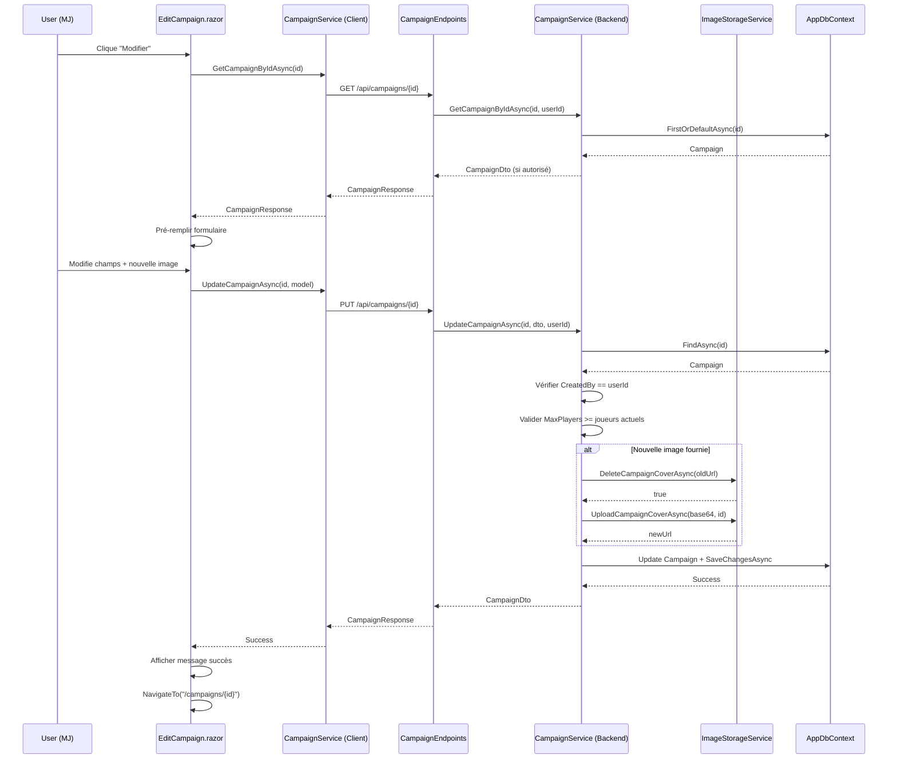
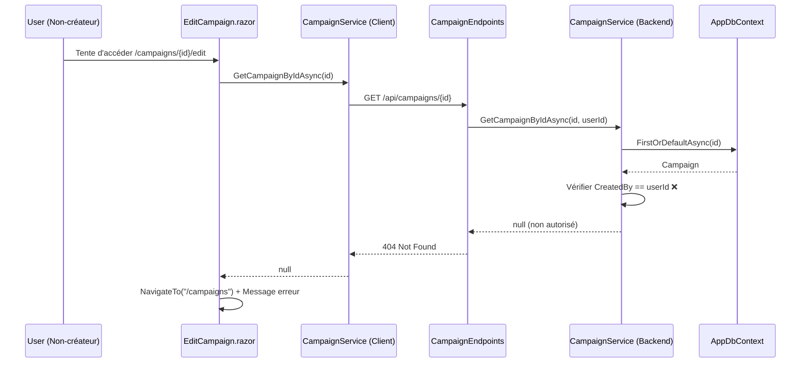
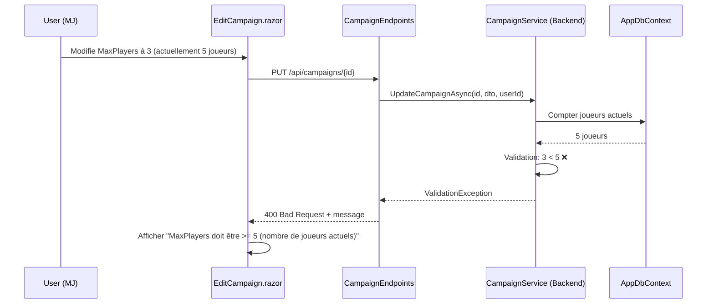

# US-012 - Modification de Campagne - Document de Conception

## 📋 Vue d'Ensemble

### Objectif
Permettre au Maître du Jeu (créateur) de modifier les informations d'une campagne existante tout en préservant l'intégrité des données et en respectant les contraintes métier.

### Périmètre
- Modification des informations éditables d'une campagne
- Gestion du remplacement de l'image de couverture
- Validation des contraintes (MaxPlayers >= joueurs actuels)
- Autorisation stricte (créateur uniquement)
- Audit trail avec UpdatedAt

### Prérequis
- ✅ US-011 complétée (Création de campagne)
- ✅ Table Campaigns existante avec données
- ✅ ImageStorageService opérationnel

---

## 🏗️ Architecture Technique

### Stack Technique
- **.NET 10** : Backend API
- **Blazor Server** : Frontend interactif
- **Entity Framework Core 10** : ORM
- **SQL Server** : Base de données
- **xUnit v3** : Tests unitaires

### Pattern Architecture
```
[Blazor Page] → [Client Service] → [HTTP API] → [Business Service] → [Repository/DbContext] → [SQL Server]
     ↓              ↓                   ↓              ↓                      ↓
EditCampaign → CampaignService → CampaignEndpoints → CampaignService → AppDbContext → Campaigns
                                        ↓
                                 ImageStorageService
```

---

## 📊 Modèle de Données

### Entité Existante (Pas de modification)
```csharp
// Cdm.Data.Common/Models/Campaign.cs
public class Campaign
{
    public int Id { get; set; }
    public string Name { get; set; } = string.Empty;              // MODIFIABLE
    public string? Description { get; set; }                      // MODIFIABLE
    public GameType GameType { get; set; }                        // NON MODIFIABLE ⚠️
    public Visibility Visibility { get; set; }                    // MODIFIABLE
    public int MaxPlayers { get; set; }                           // MODIFIABLE (avec contrainte)
    public string? CoverImageUrl { get; set; }                    // MODIFIABLE (remplacement)
    public int CreatedBy { get; set; }                            // NON MODIFIABLE
    public DateTime CreatedAt { get; set; }                       // NON MODIFIABLE
    public DateTime? UpdatedAt { get; set; }                      // AUTO (horodatage)
    public bool IsActive { get; set; }
    public bool IsDeleted { get; set; }
    
    // Navigation
    public User User { get; set; } = null!;
}
```

**Note** : La colonne `UpdatedAt` existe déjà (créée dans US-011), pas besoin de migration.

### Contraintes de Validation
| Champ | Contrainte | Logique Métier |
|-------|-----------|----------------|
| Name | 3-100 caractères, Required | Identique à création |
| Description | Max 5000 caractères | Identique à création |
| MaxPlayers | 1-20, >= nombre joueurs actuels | **Nouvelle contrainte** ⚠️ |
| GameType | **Non modifiable** | Verrouillé après création |
| CoverImageUrl | JPEG/PNG/WebP, 5MB max | Remplacement géré |

---

## 🔄 Flux de Données

### Flux Principal : Modification Réussie



### Flux d'Erreur : Non Autorisé



### Flux d'Erreur : MaxPlayers < Joueurs Actuels



---

## 🔧 Implémentation Backend

### 1. DTO - UpdateCampaignDto.cs

**Fichier** : `Cdm.Business.Abstraction/DTOs/UpdateCampaignDto.cs`

```csharp
// -----------------------------------------------------------------------
// <copyright file="UpdateCampaignDto.cs" company="ANGIBAUD Tommy">
// Copyright (c) ANGIBAUD Tommy. All rights reserved.
// </copyright>
// -----------------------------------------------------------------------

namespace Cdm.Business.Abstraction.DTOs;

using System.ComponentModel.DataAnnotations;
using Cdm.Common.Enums;

/// <summary>
/// DTO for updating an existing campaign.
/// </summary>
public class UpdateCampaignDto
{
    /// <summary>
    /// Gets or sets the campaign name (3-100 characters).
    /// </summary>
    [Required(ErrorMessage = "Campaign name is required.")]
    [StringLength(100, MinimumLength = 3, ErrorMessage = "Name must be between 3 and 100 characters.")]
    public string Name { get; set; } = string.Empty;

    /// <summary>
    /// Gets or sets the campaign description (max 5000 characters).
    /// </summary>
    [MaxLength(5000, ErrorMessage = "Description cannot exceed 5000 characters.")]
    public string? Description { get; set; }

    /// <summary>
    /// Gets or sets the campaign visibility.
    /// </summary>
    [Required(ErrorMessage = "Visibility is required.")]
    public Visibility Visibility { get; set; }

    /// <summary>
    /// Gets or sets the maximum number of players (1-20).
    /// Note: Cannot be less than current player count (validated in service).
    /// </summary>
    [Required(ErrorMessage = "Max players is required.")]
    [Range(1, 20, ErrorMessage = "Max players must be between 1 and 20.")]
    public int MaxPlayers { get; set; }

    /// <summary>
    /// Gets or sets the cover image in Base64 format.
    /// If null or empty, the existing image is kept.
    /// </summary>
    public string? CoverImageBase64 { get; set; }
}
```

**Notes importantes** :
- ❌ **Pas de GameType** (non modifiable)
- ❌ **Pas de CreatedBy** (non modifiable)
- ✅ **CoverImageBase64 optionnel** (null = conserver image actuelle)

### 2. Interface Service - ICampaignService.cs (Ajout méthode)

**Fichier** : `Cdm.Business.Abstraction/Services/ICampaignService.cs`

```csharp
// Ajouter cette méthode à l'interface existante

/// <summary>
/// Updates an existing campaign.
/// Only the creator can update their campaign.
/// </summary>
/// <param name="campaignId">The campaign ID to update.</param>
/// <param name="dto">The update data.</param>
/// <param name="userId">The user ID making the request (for authorization).</param>
/// <returns>The updated campaign DTO, or null if not authorized.</returns>
/// <exception cref="ValidationException">Thrown when MaxPlayers is less than current player count.</exception>
Task<CampaignDto?> UpdateCampaignAsync(int campaignId, UpdateCampaignDto dto, int userId);
```

### 3. Implémentation Service - CampaignService.cs

**Fichier** : `Cdm.Business.Common/Services/CampaignService.cs`

```csharp
// Ajouter cette méthode à la classe CampaignService existante

/// <inheritdoc/>
public async Task<CampaignDto?> UpdateCampaignAsync(int campaignId, UpdateCampaignDto dto, int userId)
{
    this.logger.LogInformation("Updating campaign {CampaignId} by user {UserId}", campaignId, userId);

    // 1. Retrieve campaign with tracking
    var campaign = await this.context.Campaigns
        .FirstOrDefaultAsync(c => c.Id == campaignId && !c.IsDeleted);

    if (campaign == null)
    {
        this.logger.LogWarning("Campaign {CampaignId} not found", campaignId);
        return null;
    }

    // 2. Authorization check: only creator can update
    if (campaign.CreatedBy != userId)
    {
        this.logger.LogWarning(
            "User {UserId} attempted to update campaign {CampaignId} created by {CreatedBy}",
            userId,
            campaignId,
            campaign.CreatedBy);
        return null; // Not authorized
    }

    // 3. Validate MaxPlayers constraint (cannot be less than current player count)
    // Note: Cette fonctionnalité nécessite une table CampaignPlayers (future US)
    // Pour l'instant, on autorise toute valeur entre 1-20
    // TODO: Uncomment when CampaignPlayers table exists
    /*
    var currentPlayerCount = await this.context.CampaignPlayers
        .CountAsync(cp => cp.CampaignId == campaignId);

    if (dto.MaxPlayers < currentPlayerCount)
    {
        throw new ValidationException(
            $"Max players cannot be less than current player count ({currentPlayerCount}).");
    }
    */

    // 4. Update scalar properties
    campaign.Name = dto.Name;
    campaign.Description = dto.Description;
    campaign.Visibility = dto.Visibility;
    campaign.MaxPlayers = dto.MaxPlayers;
    campaign.UpdatedAt = DateTime.UtcNow;

    // 5. Handle cover image update
    if (!string.IsNullOrWhiteSpace(dto.CoverImageBase64))
    {
        this.logger.LogInformation("Updating cover image for campaign {CampaignId}", campaignId);

        // Delete old image if exists
        if (!string.IsNullOrWhiteSpace(campaign.CoverImageUrl))
        {
            await this.imageStorageService.DeleteCampaignCoverAsync(campaign.CoverImageUrl);
        }

        // Upload new image
        var newImageUrl = await this.imageStorageService.UploadCampaignCoverAsync(
            dto.CoverImageBase64,
            campaign.Id);

        if (newImageUrl == null)
        {
            this.logger.LogWarning("Failed to upload new cover image for campaign {CampaignId}", campaignId);
            throw new InvalidOperationException("Invalid image format or size.");
        }

        campaign.CoverImageUrl = newImageUrl;
    }

    // 6. Save changes
    await this.context.SaveChangesAsync();

    this.logger.LogInformation("Campaign {CampaignId} updated successfully", campaignId);

    // 7. Return updated DTO
    return this.MapToDto(campaign);
}
```

**Points clés** :
- 🔒 **Authorization** : `CreatedBy == userId`
- ⚠️ **MaxPlayers validation** : Commentée car table `CampaignPlayers` n'existe pas encore (future US-013)
- 🖼️ **Image replacement** : Suppression ancienne + upload nouvelle
- 📝 **Audit** : `UpdatedAt` automatique
- 🪵 **Logging** : Structured logging pour debugging

### 4. API Request Model

**Fichier** : `Cdm.ApiService/Endpoints/Models/UpdateCampaignRequest.cs`

```csharp
// -----------------------------------------------------------------------
// <copyright file="UpdateCampaignRequest.cs" company="ANGIBAUD Tommy">
// Copyright (c) ANGIBAUD Tommy. All rights reserved.
// </copyright>
// -----------------------------------------------------------------------

namespace Cdm.ApiService.Endpoints.Models;

using System.ComponentModel.DataAnnotations;
using Cdm.Common.Enums;

/// <summary>
/// Request model for updating a campaign.
/// </summary>
public class UpdateCampaignRequest
{
    /// <summary>
    /// Gets or sets the campaign name.
    /// </summary>
    [Required]
    [StringLength(100, MinimumLength = 3)]
    public string Name { get; set; } = string.Empty;

    /// <summary>
    /// Gets or sets the campaign description.
    /// </summary>
    [MaxLength(5000)]
    public string? Description { get; set; }

    /// <summary>
    /// Gets or sets the campaign visibility.
    /// </summary>
    [Required]
    public Visibility Visibility { get; set; }

    /// <summary>
    /// Gets or sets the maximum number of players.
    /// </summary>
    [Required]
    [Range(1, 20)]
    public int MaxPlayers { get; set; }

    /// <summary>
    /// Gets or sets the cover image in Base64 format.
    /// If null or empty, the existing image is kept.
    /// </summary>
    public string? CoverImageBase64 { get; set; }
}
```

### 5. API Endpoint - PUT /api/campaigns/{id}

**Fichier** : `Cdm.ApiService/Endpoints/CampaignEndpoints.cs` (ajout méthode)

```csharp
// Ajouter cette méthode à la classe statique MapCampaignEndpoints

/// <summary>
/// Maps the PUT /api/campaigns/{id} endpoint.
/// </summary>
private static void MapUpdateCampaign(RouteGroupBuilder group)
{
    group.MapPut("/{id:int}", async (
        int id,
        UpdateCampaignRequest request,
        ICampaignService campaignService,
        HttpContext httpContext) =>
    {
        // Extract user ID from JWT claims
        var userIdClaim = httpContext.User.FindFirst(ClaimTypes.NameIdentifier);
        if (userIdClaim == null || !int.TryParse(userIdClaim.Value, out var userId))
        {
            return Results.Unauthorized();
        }

        // Map request to DTO
        var dto = new UpdateCampaignDto
        {
            Name = request.Name,
            Description = request.Description,
            Visibility = request.Visibility,
            MaxPlayers = request.MaxPlayers,
            CoverImageBase64 = request.CoverImageBase64,
        };

        // Call service
        CampaignDto? result;
        try
        {
            result = await campaignService.UpdateCampaignAsync(id, dto, userId);
        }
        catch (ValidationException ex)
        {
            return Results.BadRequest(new { error = ex.Message });
        }
        catch (InvalidOperationException ex)
        {
            return Results.BadRequest(new { error = ex.Message });
        }

        if (result == null)
        {
            return Results.NotFound(new { error = "Campaign not found or you are not authorized to update it." });
        }

        // Map to response
        var response = new CampaignResponse
        {
            Id = result.Id,
            Name = result.Name,
            Description = result.Description,
            GameType = result.GameType,
            Visibility = result.Visibility,
            MaxPlayers = result.MaxPlayers,
            CoverImageUrl = result.CoverImageUrl,
            CreatedBy = result.CreatedBy,
            CreatedAt = result.CreatedAt,
            UpdatedAt = result.UpdatedAt,
            IsActive = result.IsActive,
        };

        return Results.Ok(response);
    })
    .RequireAuthorization()
    .WithName("UpdateCampaign")
    .WithOpenApi();
}
```

**Modifier la méthode principale** :

```csharp
public static void MapCampaignEndpoints(this IEndpointRouteBuilder app)
{
    var group = app.MapGroup("/api/campaigns")
        .WithTags("Campaigns");

    MapCreateCampaign(group);
    MapUpdateCampaign(group);  // ← Ajouter cette ligne
}
```

**Sécurité** :
- 🔐 `RequireAuthorization()` : JWT requis
- ❌ Pas de `RequireRole("GameMaster")` : N'importe quel utilisateur peut modifier SA campagne
- 🔒 Autorisation vérifiée dans le service (CreatedBy)

### 6. Codes de Retour HTTP

| Code | Scénario | Body Response |
|------|----------|---------------|
| **200 OK** | Modification réussie | `CampaignResponse` |
| **400 Bad Request** | Validation échouée | `{ "error": "MaxPlayers must be >= 3 (current players)" }` |
| **400 Bad Request** | Image invalide | `{ "error": "Invalid image format or size." }` |
| **401 Unauthorized** | Pas de JWT | - |
| **404 Not Found** | Campagne introuvable OU non autorisé | `{ "error": "Campaign not found or you are not authorized..." }` |

**Note** : On retourne 404 (et non 403) pour ne pas révéler l'existence de campagnes privées.

---

## 🎨 Implémentation Frontend

### 1. Page EditCampaign.razor

**Fichier** : `Cdm.Web/Components/Pages/Campaigns/EditCampaign.razor`

```razor
@page "/campaigns/{Id:int}/edit"
@attribute [Authorize]
@rendermode InteractiveServer
@layout AppLayout

@using Cdm.Common.Enums
@using Cdm.Web.Components.Campaigns
@using Cdm.Web.Services
@using Microsoft.AspNetCore.Authorization

@inject ICampaignService CampaignService
@inject NavigationManager NavigationManager
@inject ILogger<EditCampaign> Logger

<PageTitle>Edit Campaign - Chronique des Mondes</PageTitle>

<div class="container mt-4">
    <div class="row justify-content-center">
        <div class="col-md-8">
            <div class="card shadow">
                <div class="card-header bg-primary text-white">
                    <h3 class="mb-0">
                        <i class="bi bi-pencil-square me-2"></i>Edit Campaign
                    </h3>
                </div>
                <div class="card-body">
                    @if (this.isLoading)
                    {
                        <div class="text-center py-5">
                            <div class="spinner-border text-primary" role="status">
                                <span class="visually-hidden">Loading...</span>
                            </div>
                            <p class="mt-3">Loading campaign details...</p>
                        </div>
                    }
                    else if (this.campaign == null)
                    {
                        <div class="alert alert-danger" role="alert">
                            <i class="bi bi-exclamation-triangle me-2"></i>
                            Campaign not found or you don't have permission to edit it.
                        </div>
                        <button class="btn btn-secondary" @onclick="GoBack">
                            <i class="bi bi-arrow-left me-2"></i>Back to Campaigns
                        </button>
                    }
                    else
                    {
                        @if (!string.IsNullOrEmpty(this.errorMessage))
                        {
                            <div class="alert alert-danger alert-dismissible fade show" role="alert">
                                <i class="bi bi-exclamation-circle me-2"></i>
                                @this.errorMessage
                                <button type="button" class="btn-close" @onclick="() => this.errorMessage = null"></button>
                            </div>
                        }

                        @if (this.isSuccess)
                        {
                            <div class="alert alert-success" role="alert">
                                <i class="bi bi-check-circle me-2"></i>
                                Campaign updated successfully! Redirecting...
                            </div>
                        }
                        else
                        {
                            <CampaignForm 
                                Model="this.editModel"
                                IsEditMode="true"
                                ExistingImageUrl="@this.campaign.CoverImageUrl"
                                GameType="@this.campaign.GameType"
                                OnSubmit="HandleUpdateCampaign"
                                OnCancel="GoBack" />
                        }
                    }
                </div>
            </div>
        </div>
    </div>
</div>

@code {
    /// <summary>
    /// Gets or sets the campaign ID from route parameter.
    /// </summary>
    [Parameter]
    public int Id { get; set; }

    private CampaignResponse? campaign;
    private CampaignFormModel editModel = new();
    private bool isLoading = true;
    private bool isSuccess = false;
    private string? errorMessage;

    /// <inheritdoc/>
    protected override async Task OnInitializedAsync()
    {
        try
        {
            this.campaign = await this.CampaignService.GetCampaignByIdAsync(this.Id);

            if (this.campaign != null)
            {
                // Pre-fill form with existing data
                this.editModel = new CampaignFormModel
                {
                    Name = this.campaign.Name,
                    Description = this.campaign.Description,
                    GameType = this.campaign.GameType, // Display only, not editable
                    Visibility = this.campaign.Visibility,
                    MaxPlayers = this.campaign.MaxPlayers,
                    CoverImageBase64 = null, // Will be set if user uploads new image
                };
            }
        }
        catch (Exception ex)
        {
            this.Logger.LogError(ex, "Error loading campaign {CampaignId}", this.Id);
            this.errorMessage = "Failed to load campaign details.";
        }
        finally
        {
            this.isLoading = false;
        }
    }

    private async Task HandleUpdateCampaign(CampaignFormModel model)
    {
        try
        {
            this.errorMessage = null;

            var result = await this.CampaignService.UpdateCampaignAsync(this.Id, model);

            if (result != null)
            {
                this.isSuccess = true;
                this.Logger.LogInformation("Campaign {CampaignId} updated successfully", this.Id);

                // Redirect to campaign details after 1.5 seconds
                await Task.Delay(1500);
                this.NavigationManager.NavigateTo($"/campaigns/{this.Id}");
            }
            else
            {
                this.errorMessage = "Failed to update campaign. Please try again.";
            }
        }
        catch (Exception ex)
        {
            this.Logger.LogError(ex, "Error updating campaign {CampaignId}", this.Id);
            this.errorMessage = ex.Message;
        }
    }

    private void GoBack()
    {
        this.NavigationManager.NavigateTo("/campaigns");
    }
}
```

### 2. Modification CampaignForm.razor (Support Mode Edit)

**Fichier** : `Cdm.Web/Components/Campaigns/CampaignForm.razor` (modifications)

**Ajouter ces paramètres** :

```razor
@code {
    // ... existing parameters ...

    /// <summary>
    /// Gets or sets a value indicating whether the form is in edit mode.
    /// </summary>
    [Parameter]
    public bool IsEditMode { get; set; } = false;

    /// <summary>
    /// Gets or sets the existing image URL (for edit mode).
    /// </summary>
    [Parameter]
    public string? ExistingImageUrl { get; set; }

    /// <summary>
    /// Gets or sets the game type (read-only in edit mode).
    /// </summary>
    [Parameter]
    public GameType? GameType { get; set; }

    /// <summary>
    /// Gets or sets the cancel callback.
    /// </summary>
    [Parameter]
    public EventCallback OnCancel { get; set; }

    // ... existing code ...
}
```

**Modifier la section GameType** :

```razor
<!-- Game Type -->
<div class="mb-3">
    <label for="gameType" class="form-label">Game System *</label>
    @if (this.IsEditMode)
    {
        <!-- Read-only in edit mode -->
        <input type="text" 
               class="form-control" 
               value="@this.GameType?.ToString()" 
               readonly 
               disabled />
        <small class="text-muted">
            <i class="bi bi-lock me-1"></i>Game type cannot be changed after creation
        </small>
    }
    else
    {
        <!-- Editable in create mode -->
        <InputSelect id="gameType" 
                     class="form-select" 
                     @bind-Value="this.Model.GameType">
            <option value="">-- Select a game system --</option>
            @foreach (var gameType in Enum.GetValues<GameType>())
            {
                <option value="@gameType">@gameType</option>
            }
        </InputSelect>
        <ValidationMessage For="() => this.Model.GameType" />
    }
</div>
```

**Modifier la section Image** :

```razor
<!-- Cover Image -->
<div class="mb-3">
    <label class="form-label">Cover Image</label>
    
    @if (this.IsEditMode && !string.IsNullOrEmpty(this.ExistingImageUrl))
    {
        <div class="mb-2">
            <p class="text-muted mb-1">Current image:</p>
            
            <p class="text-muted mt-1">
                <small>Upload a new image to replace the current one, or leave empty to keep it.</small>
            </p>
        </div>
    }
    
    <ImageUploader InputId="coverImage" 
                   OnImageSelected="HandleImageSelected" />
</div>
```

**Ajouter bouton Cancel** :

```razor
<!-- Submit Buttons -->
<div class="d-flex gap-2">
    <button type="submit" 
            class="btn btn-primary flex-grow-1" 
            disabled="@this.isSubmitting">
        @if (this.isSubmitting)
        {
            <span class="spinner-border spinner-border-sm me-2"></span>
        }
        <i class="bi bi-save me-2"></i>
        @(this.IsEditMode ? "Update Campaign" : "Create Campaign")
    </button>

    @if (this.IsEditMode)
    {
        <button type="button" 
                class="btn btn-secondary" 
                @onclick="() => this.OnCancel.InvokeAsync()">
            <i class="bi bi-x-circle me-2"></i>Cancel
        </button>
    }
</div>
```

### 3. Service Client - ICampaignService.cs (Ajout méthode)

**Fichier** : `Cdm.Web/Services/ICampaignService.cs`

```csharp
// Ajouter cette méthode à l'interface

/// <summary>
/// Updates an existing campaign.
/// </summary>
/// <param name="campaignId">The campaign ID to update.</param>
/// <param name="model">The campaign data to update.</param>
/// <returns>The updated campaign response, or null if failed.</returns>
Task<CampaignResponse?> UpdateCampaignAsync(int campaignId, CampaignFormModel model);

/// <summary>
/// Gets a campaign by ID.
/// </summary>
/// <param name="campaignId">The campaign ID.</param>
/// <returns>The campaign response, or null if not found.</returns>
Task<CampaignResponse?> GetCampaignByIdAsync(int campaignId);
```

### 4. Service Client - CampaignService.cs (Implémentation)

**Fichier** : `Cdm.Web/Services/CampaignService.cs`

```csharp
// Ajouter ces méthodes à la classe CampaignService

/// <inheritdoc/>
public async Task<CampaignResponse?> GetCampaignByIdAsync(int campaignId)
{
    try
    {
        // Add authorization header
        await this.AddAuthHeaderAsync();

        // Call API
        var response = await this.httpClient.GetAsync($"api/campaigns/{campaignId}");

        if (response.IsSuccessStatusCode)
        {
            return await response.Content.ReadFromJsonAsync<CampaignResponse>();
        }

        this.logger.LogWarning("Failed to get campaign {CampaignId}: {StatusCode}", campaignId, response.StatusCode);
        return null;
    }
    catch (Exception ex)
    {
        this.logger.LogError(ex, "Error getting campaign {CampaignId}", campaignId);
        return null;
    }
}

/// <inheritdoc/>
public async Task<CampaignResponse?> UpdateCampaignAsync(int campaignId, CampaignFormModel model)
{
    try
    {
        // Map to request
        var request = new UpdateCampaignRequest
        {
            Name = model.Name,
            Description = model.Description,
            Visibility = model.Visibility,
            MaxPlayers = model.MaxPlayers,
            CoverImageBase64 = model.CoverImageBase64,
        };

        // Add authorization header
        await this.AddAuthHeaderAsync();

        // Call API
        var response = await this.httpClient.PutAsJsonAsync($"api/campaigns/{campaignId}", request);

        if (response.IsSuccessStatusCode)
        {
            return await response.Content.ReadFromJsonAsync<CampaignResponse>();
        }

        // Handle error response
        if (response.StatusCode == System.Net.HttpStatusCode.BadRequest)
        {
            var errorContent = await response.Content.ReadAsStringAsync();
            this.logger.LogWarning("Validation error updating campaign {CampaignId}: {Error}", campaignId, errorContent);
            throw new InvalidOperationException($"Validation failed: {errorContent}");
        }

        this.logger.LogWarning("Failed to update campaign {CampaignId}: {StatusCode}", campaignId, response.StatusCode);
        return null;
    }
    catch (Exception ex)
    {
        this.logger.LogError(ex, "Error updating campaign {CampaignId}", campaignId);
        throw;
    }
}

/// <summary>
/// Request model for updating a campaign (nested class).
/// </summary>
private class UpdateCampaignRequest
{
    public string Name { get; set; } = string.Empty;
    public string? Description { get; set; }
    public Visibility Visibility { get; set; }
    public int MaxPlayers { get; set; }
    public string? CoverImageBase64 { get; set; }
}
```

### 5. Modèle Formulaire - CampaignFormModel.cs

**Fichier** : Le modèle existe déjà dans `CampaignForm.razor` (classe imbriquée), pas de modification nécessaire.

---

## 🧪 Tests

### 1. Tests Unitaires - CampaignServiceTests.cs

**Fichier** : `Cdm.Business.Common.Tests/Services/CampaignServiceTests.cs` (ajouts)

```csharp
/// <summary>
/// Tests that UpdateCampaignAsync successfully updates a campaign with valid data.
/// </summary>
[Fact]
public async Task UpdateCampaignAsync_ValidData_UpdatesCampaign()
{
    // Arrange
    var options = new DbContextOptionsBuilder<AppDbContext>()
        .UseInMemoryDatabase(databaseName: "TestDb_UpdateCampaign_Success")
        .Options;

    using var context = new AppDbContext(options);

    // Create user and campaign
    var user = new User { Id = 1, Email = "gm@test.com", PasswordHash = "hash" };
    var campaign = new Campaign
    {
        Id = 1,
        Name = "Original Name",
        Description = "Original Description",
        GameType = GameType.DnD5e,
        Visibility = Visibility.Private,
        MaxPlayers = 6,
        CreatedBy = 1,
        CreatedAt = DateTime.UtcNow,
        IsActive = true,
    };

    context.Users.Add(user);
    context.Campaigns.Add(campaign);
    await context.SaveChangesAsync();

    var service = new CampaignService(context, this.imageStorageServiceMock.Object, this.loggerMock.Object);

    var updateDto = new UpdateCampaignDto
    {
        Name = "Updated Name",
        Description = "Updated Description",
        Visibility = Visibility.Public,
        MaxPlayers = 8,
    };

    // Act
    var result = await service.UpdateCampaignAsync(1, updateDto, 1);

    // Assert
    Assert.NotNull(result);
    Assert.Equal("Updated Name", result.Name);
    Assert.Equal("Updated Description", result.Description);
    Assert.Equal(Visibility.Public, result.Visibility);
    Assert.Equal(8, result.MaxPlayers);
    Assert.NotNull(result.UpdatedAt);

    // Verify in DB
    var updatedCampaign = await context.Campaigns.FindAsync(1);
    Assert.NotNull(updatedCampaign);
    Assert.Equal("Updated Name", updatedCampaign.Name);
    Assert.NotNull(updatedCampaign.UpdatedAt);
}

/// <summary>
/// Tests that UpdateCampaignAsync returns null for non-creator.
/// </summary>
[Fact]
public async Task UpdateCampaignAsync_NonCreator_ReturnsNull()
{
    // Arrange
    var options = new DbContextOptionsBuilder<AppDbContext>()
        .UseInMemoryDatabase(databaseName: "TestDb_UpdateCampaign_NonCreator")
        .Options;

    using var context = new AppDbContext(options);

    var user1 = new User { Id = 1, Email = "gm1@test.com", PasswordHash = "hash" };
    var user2 = new User { Id = 2, Email = "gm2@test.com", PasswordHash = "hash" };
    var campaign = new Campaign
    {
        Id = 1,
        Name = "Test Campaign",
        GameType = GameType.DnD5e,
        CreatedBy = 1, // Created by user1
        CreatedAt = DateTime.UtcNow,
    };

    context.Users.AddRange(user1, user2);
    context.Campaigns.Add(campaign);
    await context.SaveChangesAsync();

    var service = new CampaignService(context, this.imageStorageServiceMock.Object, this.loggerMock.Object);

    var updateDto = new UpdateCampaignDto { Name = "New Name", Visibility = Visibility.Public, MaxPlayers = 5 };

    // Act
    var result = await service.UpdateCampaignAsync(1, updateDto, 2); // User2 attempts to update

    // Assert
    Assert.Null(result);

    // Verify campaign was NOT updated
    var unchangedCampaign = await context.Campaigns.FindAsync(1);
    Assert.Equal("Test Campaign", unchangedCampaign!.Name);
}

/// <summary>
/// Tests that UpdateCampaignAsync replaces cover image when new image provided.
/// </summary>
[Fact]
public async Task UpdateCampaignAsync_WithNewImage_ReplacesImage()
{
    // Arrange
    var options = new DbContextOptionsBuilder<AppDbContext>()
        .UseInMemoryDatabase(databaseName: "TestDb_UpdateCampaign_Image")
        .Options;

    using var context = new AppDbContext(options);

    var user = new User { Id = 1, Email = "gm@test.com", PasswordHash = "hash" };
    var campaign = new Campaign
    {
        Id = 1,
        Name = "Test Campaign",
        GameType = GameType.DnD5e,
        CoverImageUrl = "/uploads/campaigns/old-image.jpg",
        CreatedBy = 1,
        CreatedAt = DateTime.UtcNow,
    };

    context.Users.Add(user);
    context.Campaigns.Add(campaign);
    await context.SaveChangesAsync();

    // Mock image service
    this.imageStorageServiceMock
        .Setup(x => x.DeleteCampaignCoverAsync("/uploads/campaigns/old-image.jpg"))
        .ReturnsAsync(true);

    this.imageStorageServiceMock
        .Setup(x => x.UploadCampaignCoverAsync(It.IsAny<string>(), 1))
        .ReturnsAsync("/uploads/campaigns/new-image.jpg");

    var service = new CampaignService(context, this.imageStorageServiceMock.Object, this.loggerMock.Object);

    var updateDto = new UpdateCampaignDto
    {
        Name = "Test Campaign",
        Visibility = Visibility.Private,
        MaxPlayers = 6,
        CoverImageBase64 = "base64imagedata",
    };

    // Act
    var result = await service.UpdateCampaignAsync(1, updateDto, 1);

    // Assert
    Assert.NotNull(result);
    Assert.Equal("/uploads/campaigns/new-image.jpg", result.CoverImageUrl);

    // Verify image service called
    this.imageStorageServiceMock.Verify(
        x => x.DeleteCampaignCoverAsync("/uploads/campaigns/old-image.jpg"),
        Times.Once);

    this.imageStorageServiceMock.Verify(
        x => x.UploadCampaignCoverAsync("base64imagedata", 1),
        Times.Once);
}

/// <summary>
/// Tests that UpdateCampaignAsync returns null for non-existent campaign.
/// </summary>
[Fact]
public async Task UpdateCampaignAsync_NonExistentCampaign_ReturnsNull()
{
    // Arrange
    var options = new DbContextOptionsBuilder<AppDbContext>()
        .UseInMemoryDatabase(databaseName: "TestDb_UpdateCampaign_NotFound")
        .Options;

    using var context = new AppDbContext(options);

    var service = new CampaignService(context, this.imageStorageServiceMock.Object, this.loggerMock.Object);

    var updateDto = new UpdateCampaignDto
    {
        Name = "Test",
        Visibility = Visibility.Public,
        MaxPlayers = 5,
    };

    // Act
    var result = await service.UpdateCampaignAsync(999, updateDto, 1);

    // Assert
    Assert.Null(result);
}
```

### 2. Tests Unitaires - ImageStorageService (Pas de modification)

Les tests existants pour `ImageStorageService` couvrent déjà `DeleteCampaignCoverAsync` et `UploadCampaignCoverAsync`.

---

## 📝 Liste des Tâches d'Implémentation

### Phase 1 : Backend (API)
1. ✅ Créer `UpdateCampaignDto.cs` dans `Cdm.Business.Abstraction/DTOs`
2. ✅ Ajouter méthode `UpdateCampaignAsync` à `ICampaignService.cs`
3. ✅ Implémenter `UpdateCampaignAsync` dans `CampaignService.cs`
4. ✅ Créer `UpdateCampaignRequest.cs` dans `Cdm.ApiService/Endpoints/Models`
5. ✅ Ajouter endpoint `PUT /api/campaigns/{id}` dans `CampaignEndpoints.cs`
6. ✅ Ajouter endpoint `GET /api/campaigns/{id}` dans `CampaignEndpoints.cs` (pour pré-remplissage)

### Phase 2 : Frontend
7. ✅ Modifier `CampaignForm.razor` pour supporter mode edit
8. ✅ Créer page `EditCampaign.razor`
9. ✅ Ajouter méthodes `GetCampaignByIdAsync` et `UpdateCampaignAsync` à `ICampaignService.cs` (client)
10. ✅ Implémenter méthodes dans `CampaignService.cs` (client)

### Phase 3 : Tests
11. ✅ Ajouter 4 tests unitaires dans `CampaignServiceTests.cs`
12. ⏭️ Tests d'intégration (optionnel)
13. ⏭️ Tests E2E (optionnel)

### Phase 4 : Finalisation
14. ⏭️ Mettre à jour documentation API (API_ENDPOINTS.md)
15. ✅ Vérifier build et tests
16. ✅ Créer PR avec GitHub Copilot reviewer

---

## 🔐 Considérations de Sécurité

### Autorisation
- ✅ **JWT requis** : `[Authorize]` sur l'endpoint
- ✅ **Creator-only** : Vérification `CreatedBy == userId` dans le service
- ✅ **404 au lieu de 403** : Ne pas révéler l'existence de campagnes privées

### Validation
- ✅ **DataAnnotations** : Validation côté client et serveur
- ✅ **MaxPlayers constraint** : Prévu (TODO quand table CampaignPlayers existera)
- ✅ **GameType immutable** : Read-only en frontend, pas dans DTO

### Gestion Images
- ✅ **Suppression ancienne image** : Évite accumulation fichiers orphelins
- ✅ **Magic byte validation** : Réutilisation `ImageStorageService` existant
- ✅ **5MB limit** : Déjà implémenté dans `ImageStorageService`

---

## 📊 Estimation

| Phase | Tâches | Temps Estimé |
|-------|--------|--------------|
| Backend API | 1-6 | 2-3 heures |
| Frontend | 7-10 | 2-3 heures |
| Tests | 11-13 | 1-2 heures |
| Documentation | 14 | 30 min |
| **TOTAL** | **14 tâches** | **6-8 heures** |

**Story Points** : **3** (complexité faible, effort moyen)

---

## ✅ Checklist de Validation

### Fonctionnel
- [ ] Le bouton "Edit" apparaît uniquement pour le créateur
- [ ] Le formulaire se pré-remplit avec les données actuelles
- [ ] GameType est affiché mais non modifiable (disabled)
- [ ] L'image actuelle s'affiche avec option de remplacement
- [ ] Les validations fonctionnent (Name, MaxPlayers, etc.)
- [ ] Message de succès + redirection après modification
- [ ] Tentative d'édition par non-créateur retourne 404

### Technique
- [ ] Endpoint `PUT /api/campaigns/{id}` fonctionnel
- [ ] Endpoint `GET /api/campaigns/{id}` fonctionnel
- [ ] Authorization vérifiée (CreatedBy)
- [ ] UpdatedAt automatiquement mis à jour
- [ ] Ancienne image supprimée si remplacée
- [ ] 4 tests unitaires passent

### Qualité
- [ ] Code suit StyleCop conventions
- [ ] XML documentation en anglais
- [ ] Logging structuré
- [ ] Gestion erreurs robuste

---

## 🎯 Prochaines US Liées

- **US-013** : Invitation de joueurs (nécessitera table `CampaignPlayers`)
- **US-014** : Suppression de campagne
- **US-015** : Liste et filtres de campagnes

---

**Document créé le** : 13 novembre 2025  
**Auteur** : GitHub Copilot  
**Version** : 1.0
