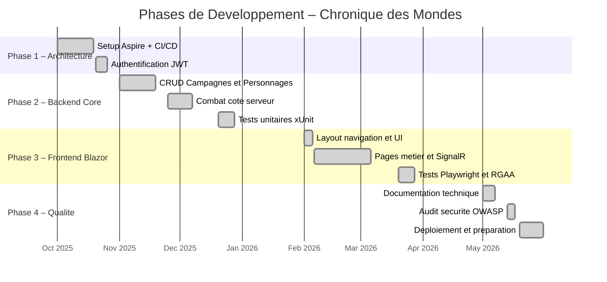
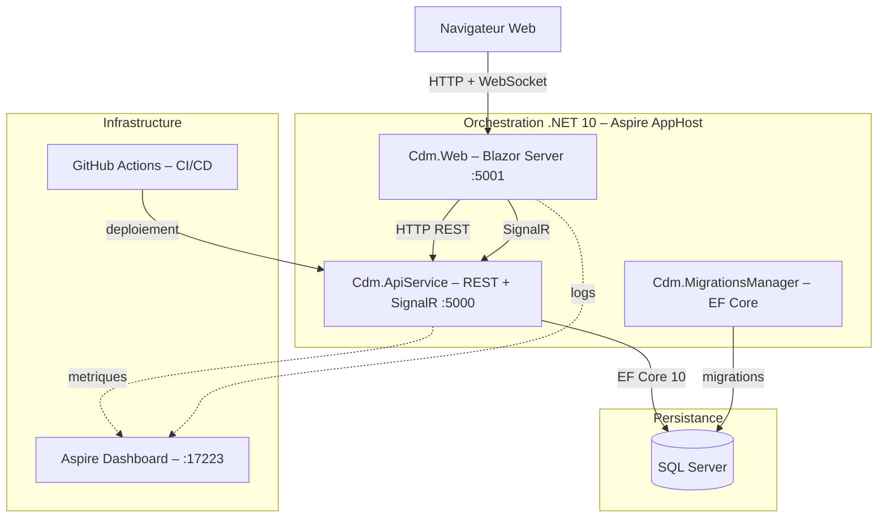
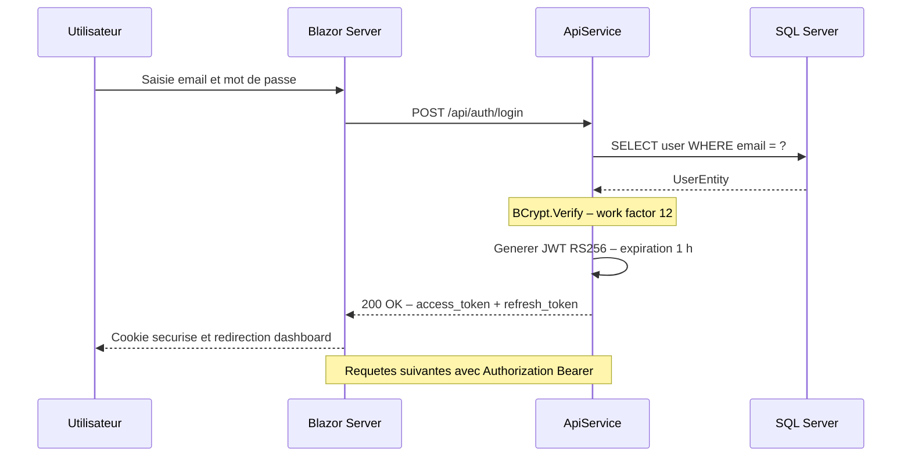
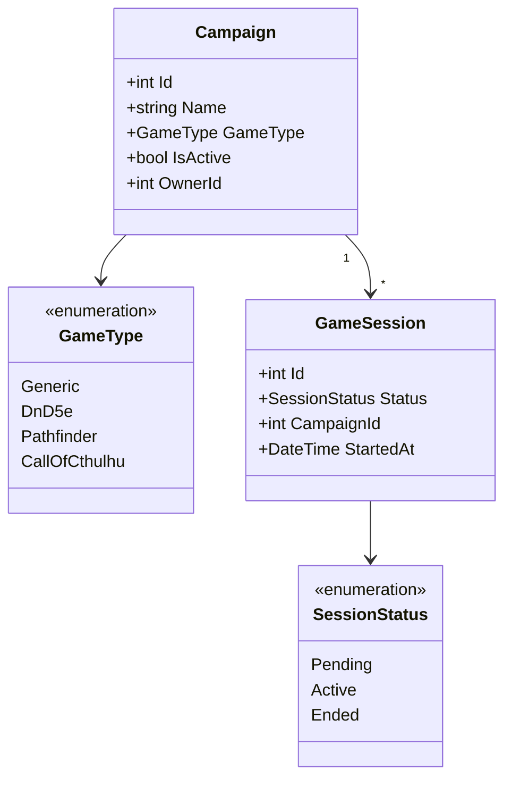
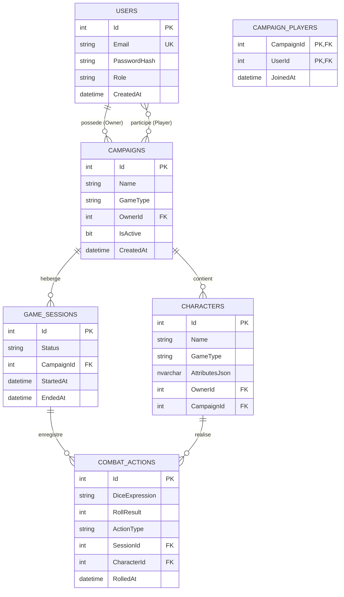
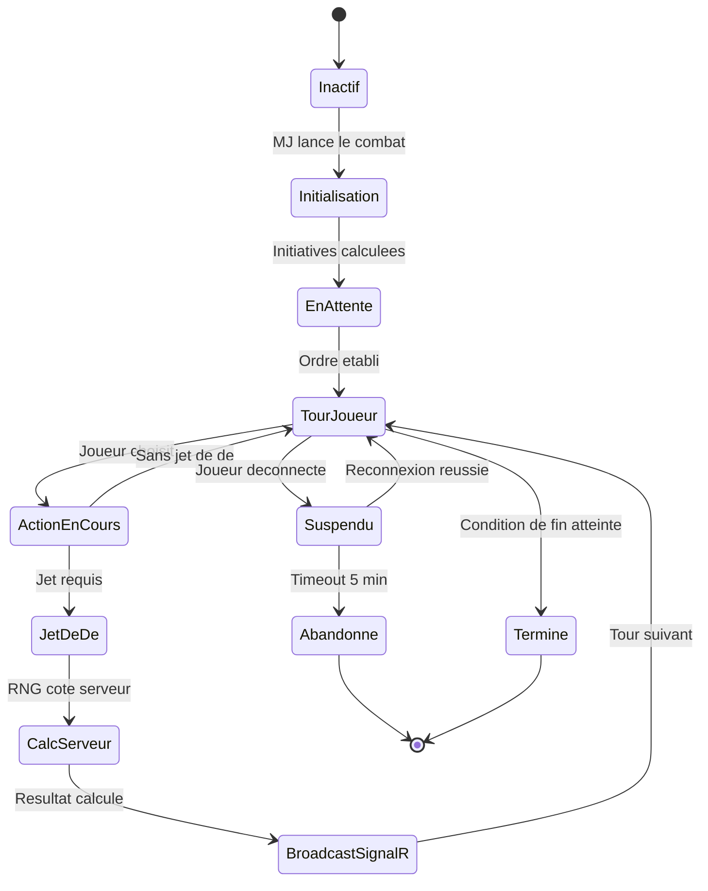
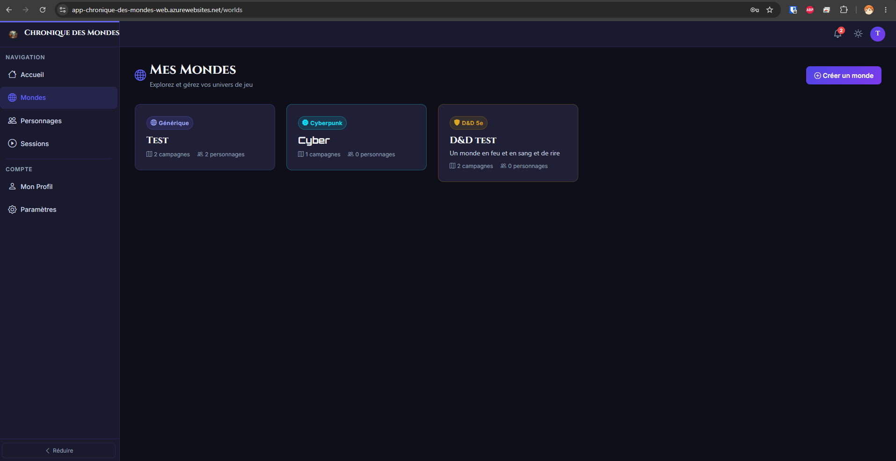
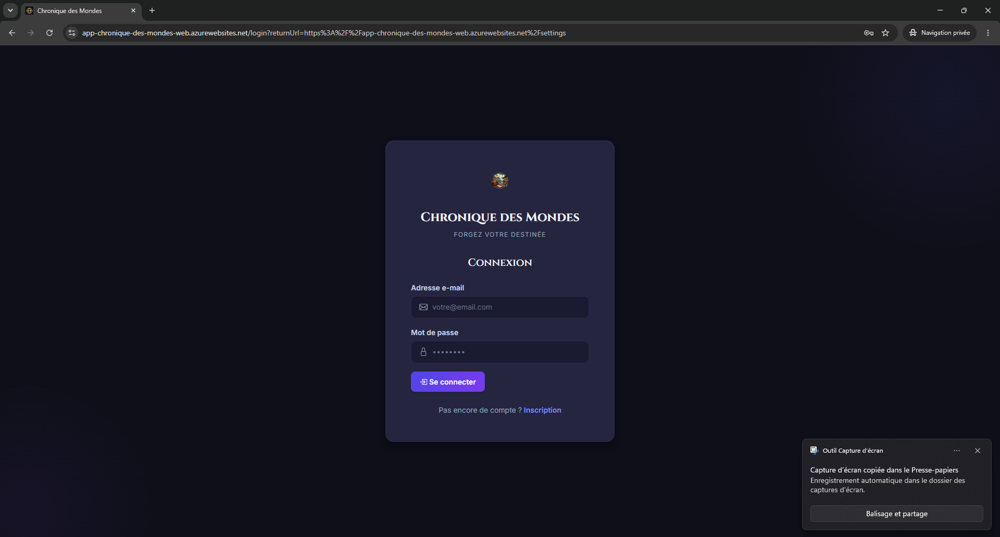

# DOSSIER BLOC 2 – CHRONIQUE DES MONDES
**CERTIFICATION RNCP 39583 – NIVEAU 7**
Expert(e) en Développement Logiciel – YNOV

---

## Section 1 – Page de garde + Sommaire

**Projet :** Chronique des Mondes
**Sous-titre :** Plateforme web de gestion de campagnes de jeu de rôle multi-systèmes

**Candidat :** [Prénom NOM]
**Formation :** Expert en Développement Logiciel – Promotion 2025/2026
**Date de dépôt :** 23 juillet 2026
**Dépôt :** DigiformaCertif – https://ynov.mycertif.app

**Équipe projet :**
– 1 Lead Tech / Architecte
– 3 Développeurs Full-Stack
– 1 Product Owner

---

**SOMMAIRE**

1. Page de garde + Sommaire
2. Présentation du projet et contexte technique
3. Environnements et CI/CD – C2.1.1 + C2.1.2
4. Prototype et architecture applicative – C2.2.1
5. Tests unitaires xUnit – C2.2.2
6. Sécurité OWASP + Accessibilité RGAA – C2.2.3
7. Versioning et déploiement progressif – C2.2.4
8. Cahier de recettes – C2.3.1
9. Plan de correction des bogues – C2.3.2
10. Documentation technique – C2.4.1
Annexes

---

## Section 2 – Présentation du projet et contexte technique

### 2.1 Contexte et objectifs

Le point de départ de ce projet est simple : en tant que joueur de jeu de rôle, les outils
disponibles sur le marché (Roll20, FoundryVTT) sont soit trop lourds à installer, soit trop
fermés à un seul système de règles. L'objectif de **Chronique des Mondes** était de concevoir
une plateforme web légère, accessible depuis un navigateur, capable de s'adapter à n'importe
quel univers de jeu – D&D 5e, Pathfinder, Cthulhu ou un système maison.

Ce projet a également été l'occasion de mettre en pratique une architecture professionnelle
de bout en bout : depuis la conception des API jusqu'au déploiement continu en production,
en passant par la sécurité, les tests automatisés et l'accessibilité.

Les fonctionnalités principales sont :
– Création et gestion de campagnes multi-systèmes avec univers, chapitres et événements narratifs
– Gestion de personnages avec feuilles de statistiques polymorphiques (attributs spécifiques
  au système de règles stockés en JSON)
– Sessions de jeu en temps réel avec résolution de combats (dés lancés côté serveur, anti-triche)
– Notifications en temps réel par SignalR (invitations de session, alertes de combat)
– Gestion des rôles : Administrateur, Maître de Jeu, Joueur

### 2.2 Équipe projet

| Rôle | Responsabilités |
|---|---|
| Lead Tech / Architecte | Décisions d'architecture, revue de code, CI/CD, sécurité |
| Développeur Full-Stack 1 | Module authentification, gestion des utilisateurs et profils |
| Développeur Full-Stack 2 | Module campagnes, chapitres, événements narratifs |
| Développeur Full-Stack 3 | Module combat temps réel, SignalR, D&D 5e |
| Product Owner | Backlog, priorisation, cahier des charges, recettes |

### 2.3 Stack technique

| Couche | Technologie |
|---|---|
| Orchestration | .NET 10 + Aspire AppHost |
| Backend API | ASP.NET Core 10 – REST + SignalR |
| Frontend | Blazor Server (.NET 10) |
| Temps réel | SignalR – SessionHub + NotificationHub |
| Persistance | EF Core 10 + SQL Server |
| Authentification | JWT Bearer (RS256) + BCrypt (work factor 12) |
| Tests unitaires | xUnit + Moq + FluentAssertions |
| Tests E2E | Playwright (.NET) |
| CI/CD | GitHub Actions |
| Monitoring | Aspire Dashboard + Serilog |
| UI Component | Microsoft Fluent UI Blazor + Design System CDM |

### 2.4 Décisions d'architecture

La première question posée en équipe a été : **comment supporter D&D 5e, Pathfinder et un
système générique sans dupliquer le code pour chaque système ?** La réponse choisie est une
architecture en couches avec un noyau commun (`Cdm.Business.Common`) et des extensions par
système de règles (`Cdm.Business.DnD5e`). Les attributs spécifiques à chaque jeu sont
sérialisés en JSON dans la base de données, ce qui permet d'ajouter un nouveau système sans
modifier le schéma. Cette décision a été la plus structurante du projet – elle guide encore
aujourd'hui l'organisation de tous les projets de la solution.

– `Cdm.AppHost` – Orchestration Aspire : déclare les services, gère la découverte de services
– `Cdm.ApiService` – API REST + Hubs SignalR : exposition des endpoints métier
– `Cdm.Web` – Blazor Server : interface utilisateur, communication API via clients HTTP typés
– `Cdm.Business.Common` – Logique métier : services, règles, validation
– `Cdm.Data.Common` – Accès aux données : modèles EF Core, repositories
– `Cdm.Common` – Transverse : JWT, BCrypt, logging structuré
– `Cdm.Business.DnD5e` – Extension D&D 5e : règles, calculs de modificateurs, SRD

Cette séparation permet l'ajout de nouveaux systèmes de règles (Pathfinder, Appel de Cthulhu)
sans modifier le noyau de l'application.

---

## Section 3 – Environnements et CI/CD
*Compétences visées : C2.1.1 – Environnements de déploiement et suivi qualité, C2.1.2 – Intégration continue GitHub Actions*

En début de projet, les déploiements se faisaient manuellement : clone, build, restart du
service Azure. Lors du sprint 3, un oubli de `dotnet restore` a mis l'API hors service
pendant 40 minutes. C'est cet incident concret qui a motivé la mise en place d'un pipeline
CI/CD automatisé : **aucun code ne peut atteindre `main` sans avoir compilé, passé les tests
unitaires et l'analyse de dépendances OWASP**. Le principe est simple : si une vérification
échoue, le pipeline s'arrête et le déploiement n'a pas lieu.

### 3.0 Poste de développement et outillage (C2.1.1)

La maîtrise de l'environnement de développement est aussi importante que le code lui-même :
un poste mal configuré génère des bugs qui n'existent qu'en local, des comportements
différents entre développeurs, et ralentit les livraisons. Voici la configuration exacte
utilisée pour ce projet.

#### 3.0.1 Environnement de travail

| Outil | Version | Rôle |
|---|---|---|
| **Windows 11** | 23H2 | Système d'exploitation |
| **Visual Studio 2022** | 17.13 | IDE principal (IntelliSense, débogueur, tests) |
| **.NET SDK** | 10.0 | Compilateur, CLI (`dotnet build`, `dotnet test`) |
| **Docker Desktop** | 4.x | Conteneurisation locale pour SQL Server + Aspire |
| **GitKraken** | dernière | Client Git graphique (branches, cherry-pick, conflits) |
| **Git CLI** | 2.x | Commits, hooks pre-commit, scripts CI |
| **SQL Server LocalDB** | 2022 | Base de données locale (via `(localdb)\mssqllocaldb`) |
| **Node.js** | 20 LTS | Build des assets CSS (Tailwind / sass) |
| **Postman** | dernière | Tests manuels des endpoints REST + SignalR |

#### 3.0.2 Extensions Visual Studio 2022

| Extension | Utilité |
|---|---|
| **.NET Aspire Workload** | Orchestration multi-services en local |
| **GitHub Copilot** | Assistance à la génération de code |
| **xUnit runner** | Exécution des tests directement dans l'IDE |
| **Playwright** | Débogage des tests E2E depuis VS |
| **EditorConfig** | Application des règles de style StyleCop |

#### 3.0.3 Configuration du poste et reproductibilité

Pour garantir la reproductibilité de l'environnement entre développeurs (et entre le poste
local et le runner GitHub Actions), les contraintes suivantes sont appliquées :

- **`global.json`** à la racine du dépôt épingle la version du SDK .NET :
```json
{
  "sdk": {
    "version": "10.0.300-preview.0.26177.108",
    "rollForward": "latestMinor"
  }
}
```
- **`.editorconfig`** normalise l'indentation (espaces, pas de tabulations), les fins de
  ligne (LF), l'encodage (UTF-8 BOM pour les fichiers .cs) — éliminant les diffs parasites
  entre Windows et le runner Linux de GitHub Actions.
- **User Secrets .NET** stockent les clés JWT et chaînes de connexion localement
  (`%APPDATA%\Microsoft\UserSecrets\`) sans jamais toucher le dépôt.
- **`.gitignore`** exclut systématiquement `bin/`, `obj/`, `*.user`, `appsettings.*.json`
  des environnements non-development.

#### 3.0.4 Accès aux environnements

| Environnement | URL d'accès | Branche source |
|---|---|---|
| Local (Aspire) | `https://localhost:7081` (Web) / `https://localhost:7080` (API) | toute branche |
| Aspire Dashboard | `http://localhost:17223` | local uniquement |
| Production | `https://cdm-web.azurewebsites.net` | `main` (via CI/CD) |
| Azure SQL | `cdm-server-sql.database.windows.net` | géré par migrations EF Core |

---

### 3.1 Environnements de déploiement (C2.1.1)

#### 3.1.1 Architecture des environnements

Le projet dispose de deux environnements distincts, adaptés à un projet personnel
mono-développeur effectif :

**Environnement local (développement)**
– Orchestration : .NET Aspire AppHost (lance automatiquement Web + API + SQL Server)
– Configuration : `appsettings.Development.json` + User Secrets .NET
  (aucun secret en clair dans le dépôt)
– Base de données : SQL Server LocalDB ou conteneur Docker
– Monitoring : Aspire Dashboard accessible sur `http://localhost:17223`
  – traces distribuées, métriques, logs structurés
– Hot reload activé (`dotnet watch`)

**Environnement de production**
– Hébergement : Azure App Service (Plan Standard)
– Deux services distincts : `cdm-web` (Blazor Server) et `cdm-api` (API REST + SignalR)
– Configuration : variables d'environnement Azure App Service
  (jamais de secrets dans les fichiers de configuration)
– Base de données : Azure SQL Database (DTU S1)
– HTTPS forcé avec HSTS (Strict-Transport-Security: max-age=31536000)
– Déploiement déclenché automatiquement par le pipeline CI/CD sur la branche `main`

**Justification du choix à deux environnements**
Pour un projet solo à usage personnel, un troisième environnement « staging » n'est pas
justifié économiquement. Dans un contexte professionnel avec plusieurs développeurs et des
clients réels, un environnement de staging serait systématiquement ajouté entre `dev` et
`production` pour permettre les recettes utilisateurs sans impacter la production.

#### 3.1.2 Gestion de la configuration

| Fichier | Environnement | Contenu |
|---|---|---|
| `appsettings.json` | Tous | Valeurs par défaut, structure |
| `appsettings.Development.json` | Local | URLs Aspire, niveaux de log détaillés |
| `appsettings.Production.json` | Azure | URLs de production, log Warning uniquement |
| User Secrets / Variables Azure | Secret | JWT secret key, chaînes de connexion |

#### 3.1.3 Suivi qualité

Le suivi qualité s'appuie sur plusieurs indicateurs mesurés à chaque exécution du pipeline CI :
– Zéro erreur de build (`/warnaserror` en Release)
– Taux de couverture des tests unitaires (cible : 70 %)
– Rapport OWASP Dependency Check (blocage si CVSS ≥ 8)
– Résultats des tests xUnit exportés au format TRX (artefacts GitHub Actions)

#### 3.1.4 Diagramme de Gantt – Phases de développement



### 3.2 Pipeline CI/CD GitHub Actions (C2.1.2)

Le fichier `.github/workflows/ci.yml` définit un pipeline en trois jobs parallèles :

```
push/PR → main, dev
    │
    ├─ [Job 1] build-and-test
    │       dotnet restore
    │       dotnet build /warnaserror
    │       dotnet test --collect XPlat Code Coverage
    │       upload artefact test-results
    │
    ├─ [Job 2] security-scan (needs: build-and-test)
    │       OWASP Dependency Check
    │       --failOnCVSS 8
    │       upload artefact owasp-report
    │
    └─ [Job 3] playwright-tests (needs: build-and-test)
            uniquement sur main et dev
            install Playwright + chromium
            dotnet test .playwright
            upload artefact playwright-report (si échec)
```

**Détail du job principal :**
– `actions/checkout@v4` avec `fetch-depth: 0`
– `actions/setup-dotnet@v4` avec `dotnet-version: 10.0.x`
– Build en configuration `Release` avec `/warnaserror`
– Collecte de couverture XPlat Code Coverage
– Export des résultats au format TRX

---

## Section 4 – Prototype et architecture applicative
*Compétence visée : C2.2.1 – Prototyper l'application (ergonomie, sécurité, architecture)*

La première version de l'interface était un prototype Blazor avec une navigation plate et
aucun système de thèmes. Rapidement, un problème est apparu : quand on passe d'une campagne
D&D à une campagne Cthulhu, le visuel doit refléter l'univers – sinon l'outil perd son âme.
Cela a conduit à la création d'un **Design System CDM** avec un système de thèmes CSS par
type de jeu, appliqué dynamiquement à chaque navigation. L'architecture présentée ci-dessous
est le résultat de ces itérations successives, depuis le prototype initial jusqu'à la version
en production aujourd'hui.

### 4.0 User Stories – Backlog représentatif

Les fonctionnalités ont été formalisées en User Stories selon la convention
*"En tant que… je veux… afin de…"*. Le backlog complet est accessible sur GitHub
(issues #38 à #50). Le tableau ci-dessous présente un sous-ensemble représentatif des
4 epics principaux :

| N° | Titre | Epic | SP | Statut |
|---|---|---|---|---|
| US-001 | Inscription utilisateur (BCrypt WF12) | Auth | 5 | ✅ Terminé |
| US-002 | Connexion utilisateur (JWT) | Auth | 5 | ✅ Terminé |
| US-006 | Gestion des rôles MJ / Joueur | Auth | 3 | ✅ Terminé |
| US-011 | Création de campagne | Campagnes | 5 | 🔄 En cours |
| US-013 | Liste des campagnes (dashboard) | Campagnes | 3 | 🔄 En cours |
| US-015 | Invitation de joueurs (code 48h) | Campagnes | 5 | 📝 Planifié |
| US-018 | Lancement d'une session (SignalR) | Sessions | 5 | 📝 Planifié |
| US-023 | Création de personnage générique | Personnages | 5 | 📝 Planifié |
| US-025 | Liste et gestion de mes personnages | Personnages | 3 | 📝 Planifié |
| US-032 | Déclenchement d'un combat (MJ) | Combat | 5 | 📝 Planifié |
| US-034 | Gestion des tours (SignalR) | Combat | 8 | 📝 Planifié |
| US-036 | Lanceur de dés côté serveur | Combat | 8 | 📝 Planifié |
| US-049 | Fiche personnage D&D 5e | D&D 5e | 8 | 📝 Planifié |

**Total backlog représentatif** : 13 US · 68 story points · 4 épics

> *Le backlog complet est disponible dans le dépôt GitHub du projet :
> `.github/backlog/` (50+ User Stories structurées par epic)*

---

### 4.1 Architecture applicative (niveau Conteneurs – modèle C4)



### 4.2 Flux d'authentification (diagramme de séquence)



### 4.3 Modèle de données – domaine Campagnes (diagramme de classes)



### 4.4 Schéma Entité-Relation (base de données)



### 4.5 Machine d'états – Système de combat SignalR



### 4.6 Ergonomie et prototype

L'interface Blazor Server repose sur un Design System CDM (fichiers CSS variables + thèmes)
permettant de changer l'apparence visuelle selon le type de jeu de la campagne.
Les éléments d'ergonomie principaux sont :
– Navigation latérale persistante avec sidebar contextuelle secondaire par section
– Fil d'Ariane dynamique dans la topbar
– Notifications temps réel (invitations de session) via SignalR avec toast visuel
– Mode sombre / mode clair mémorisé dans `localStorage`
– Interface responsive avec menu mobile adaptatif

#### 4.6.1 Capture d'écran – Dashboard "Mes Mondes"

La page ci-dessous est la page d'accueil principale après connexion. Elle illustre plusieurs
décisions d'architecture UX : la **navigation latérale contextuelle** (Accueil, Mondes,
Personnages, Sessions), les **cartes de monde** avec leur badge de système de jeu
(Générique, Cyberpunk, D&D 5e), et le bouton d'action primaire "Créer un monde" en position
haute-droite selon les conventions Material Design.

On peut y voir en production les trois univers de jeu créés lors des tests :
**Test** (Générique – 2 campagnes), **Cyber** (Cyberpunk – 1 campagne), **D&D TEST**
(D&D 5e – 2 campagnes). Chaque carte affiche le nombre de campagnes et de personnages
associés, permettant au MJ d'avoir un aperçu rapide avant de naviguer.



*Figure 1 – Page "Mes Mondes" sur `app-chronique-des-mondes-web.azurewebsites.net` –
thème sombre, navigation latérale, cards par système de jeu*

> **Note jury** : D'autres captures (page de connexion, détail campagne, interface de combat)
> peuvent être fournies sur demande ou sont disponibles à l'URL de production ci-dessus.

---

## Section 5 – Tests unitaires xUnit
*Compétence visée : C2.2.2 – Ecrire des tests unitaires (harnais de test xUnit)*

Lors du refactoring du module d'authentification (passage de HS256 à RS256 pour le JWT),
un bug de validation de token a été introduit sans qu'on s'en rende compte pendant deux
jours. La suite de tests xUnit existante l'a détecté au prochain push – avant que le code
atteigne la branche `dev`. Cet épisode a convaincu l'équipe de **traiter les tests comme une
documentation vivante du comportement attendu**, pas comme une contrainte. Chaque service
métier dispose de sa propre suite, avec trois niveaux de scénarios : le cas nominal, les
cas limites, et les cas de sécurité (accès non autorisé, token expiré).

### 5.1 Organisation des tests

Le projet `Cdm.Business.Common.Tests` contient 9 suites de tests couvrant l'ensemble
des services métier :

| Suite de tests | Service testé | Thématiques couvertes |
|---|---|---|
| `AuthServiceTests` | `AuthService` | Connexion, inscription, refresh token |
| `JwtServiceTests` | `JwtService` | Génération, validation, expiration JWT |
| `CampaignServiceTests` | `CampaignService` | CRUD campagnes, contrôle d'accès |
| `CharacterServiceTests` | `CharacterService` | CRUD personnages, attributs |
| `WorldServiceTests` | `WorldService` | Gestion des univers de jeu |
| `ChapterServiceTests` | `ChapterService` | Chapitres narratifs |
| `EventServiceTests` | `EventService` | Événements de campagne |
| `RoleServiceTests` | `RoleService` | Gestion des rôles utilisateurs |
| `UserProfileServiceTests` | `UserProfileService` | Profils, avatars |
| `AchievementServiceTests` | `AchievementService` | Succès et récompenses |
| `AvatarServiceTests` | `AvatarService` | Gestion des avatars |

### 5.2 Conventions de test – pattern AAA

Les tests respectent le pattern Arrange – Act – Assert et les standards StyleCop du projet
(préfixe `this.`, indentation 4 espaces, Allman braces, documentation XML en anglais) :

```csharp
/// <summary>
/// Unit tests for <see cref="CampaignService"/>.
/// </summary>
public sealed class CampaignServiceTests : IDisposable
{
    private readonly Mock<ICampaignRepository> repositoryMock;
    private readonly Mock<ILogger<CampaignService>> loggerMock;
    private readonly CampaignService sut;

    public CampaignServiceTests()
    {
        this.repositoryMock = new Mock<ICampaignRepository>();
        this.loggerMock = new Mock<ILogger<CampaignService>>();
        this.sut = new CampaignService(
            this.repositoryMock.Object,
            this.loggerMock.Object);
    }

    [Fact]
    public async Task GetByIdAsync_WhenEntityExists_ReturnsEntity()
    {
        // Arrange
        var campaignId = 1;
        var expected = new Campaign { Id = campaignId, Name = "Test Campaign" };
        this.repositoryMock
            .Setup(r => r.GetByIdAsync(campaignId))
            .ReturnsAsync(expected);

        // Act
        var result = await this.sut.GetByIdAsync(campaignId);

        // Assert
        result.Should().NotBeNull();
        result.Id.Should().Be(campaignId);
    }

    [Theory]
    [InlineData(0)]
    [InlineData(-1)]
    public async Task GetByIdAsync_WhenIdIsInvalid_ThrowsArgumentException(int invalidId)
    {
        await this.sut.Invoking(s => s.GetByIdAsync(invalidId))
            .Should().ThrowAsync<ArgumentException>();
    }

    public void Dispose() { }
}
```

### 5.3 Exécution et couverture

```bash
dotnet test Cdm/Cdm.slnx \
  --configuration Release \
  --collect:"XPlat Code Coverage" \
  --results-directory ./coverage \
  --logger "trx;LogFileName=test-results.trx"
```

Les résultats TRX sont publiés comme artefacts GitHub Actions à chaque pipeline CI.

### 5.4 Stratégie de test

Les tests couvrent trois niveaux de scénarios :
– **Happy path** : flux nominal, données valides, comportement attendu
– **Edge cases** : valeurs limites (ID nul ou négatif), chaînes vides, collections vides
– **Sécurité** : accès non autorisé, token expiré, tentative de modification de ressource
  appartenant à un autre utilisateur

---

## Section 6 – Sécurité OWASP + Accessibilité RGAA
*Compétence visée : C2.2.3 – Ecrire du code sécurisé (OWASP Top 10) et accessible (RGAA/OPQUAST)*

La sécurité n'a pas été ajoutée en fin de projet : elle a été intégrée dès la conception.
Le choix de BCrypt work factor 12 a été fait dès le premier sprint d'authentification, après
lecture du guide OWASP sur le stockage des mots de passe. De même, la décision de lancer
les dés **côté serveur uniquement** (et non côté client) est directement liée à la prévention
de la triche – une exigence métier du jeu de rôle. Concernant l'accessibilité, un audit
informel sur la version initiale a révélé qu'aucun lien d'évitement n'était présent et que
les formulaires n'indiquaient pas leurs champs obligatoires aux technologies d'assistance.
Ces lacunes ont été corrigées dans le sprint de qualité (commit `6e7f26b`).

### 6.1 Sécurité – OWASP Top 10

#### A01 – Contrôle d'accès défaillant

Tous les endpoints de l'API utilisent l'attribut `[Authorize]` et des policies nommées.
Les modifications de ressources vérifient que l'utilisateur connecté est bien le propriétaire
(`IsCampaignOwner`, `IsCharacterOwner`). EF Core Query Filters isolent automatiquement les
données par utilisateur au niveau de la couche d'accès aux données.

#### A02 – Défaillances cryptographiques

– Mots de passe hachés avec BCrypt, work factor 12
  (`PasswordService.cs` : `private const int WorkFactor = 12`)
– Aucune donnée sensible dans les logs
– HTTPS forcé en production avec HSTS (`max-age=31536000`)
– JWT signé avec clé secrète ≥ 32 caractères, vérifiée au démarrage

#### A03 – Injection

EF Core utilise des requêtes paramétrées par défaut, éliminant l'injection SQL.
Les données JSON polymorphiques sont sérialisées avec `System.Text.Json` sans évaluation
de code. La validation server-side avec Data Annotations est systématique sur tous les DTOs.

#### A05 – Configuration de sécurité incorrecte

En production (`ASPNETCORE_ENVIRONMENT=Production`) :
– Pages d'erreur détaillées remplacées par `app.UseExceptionHandler("/Error")`
– Dashboard Aspire non déployé en production
– Secrets stockés dans les variables d'environnement Azure App Service

#### A07 – Défaillances d'authentification

– Access token JWT : durée de vie 1 heure
– Refresh token : durée de vie 7 jours, rotation à chaque utilisation
– Protection anti-brute-force : à implémenter (prévu sprint suivant)

### 6.2 Accessibilité RGAA

Les améliorations d'accessibilité suivantes ont été implémentées dans Blazor Server
(commit `6e7f26b`, branche `features/add_agent`) :

| Critère RGAA | WCAG | Mise en oeuvre |
|---|---|---|
| **12.7** | 2.4.1 Skip Navigation | `<a href="#main-content">Aller au contenu principal</a>` dans `App.razor` |
| **7.1** | 4.1.2 Name, Role, Value | `aria-expanded` sur 4 boutons toggle (sidebar, mobile, notifications, profil) |
| **6.2** | 2.4.4 Link Purpose | `aria-current="page"` sur les 6 liens de navigation actifs |
| **11.10** | 1.3.1 Info + Relationships | `aria-required="true"` sur tous les champs obligatoires (Login, Register) |
| **11.13** | 1.3.1 Info + Relationships | `aria-describedby` liant chaque champ à son `ValidationMessage` |
| **8.3** | 3.1.1 Language of Page | `lang="fr"` sur `<html>` dans `App.razor` |
| **4.1** | 1.1.1 Non-text Content | Attributs `alt` sur toutes les images |
| **10.1** | 1.3.1 Info + Relationships | `role="alert"` sur les messages d'erreur de formulaire |

#### 6.2.1 Capture d'écran – Page de connexion (RGAA appliqué)

La page de connexion illustre directement les critères RGAA implémentés :
– Les labels "Adresse e-mail" et "Mot de passe" sont explicites et associés à leur champ
  via `<label for="...">` (critère RGAA 11.1)
– Les champs portent `aria-required="true"` et `aria-describedby` pointant vers leur
  `ValidationMessage` (critères 11.10 et 11.13)
– Le lien "Inscription" en bas du formulaire a un intitulé de lien compréhensible
  hors contexte (critère 6.1)
– Le contraste texte blanc sur fond bleu foncé (#1e1b4b) dépasse le ratio 4.5:1
  requis par le critère RGAA 3.2 / WCAG 1.4.3



*Figure 2 – Page `/login` en production : formulaire accessible, thème sombre, labels
explicites, lien d'inscription. Les attributs `aria-required` et `aria-describedby`
sont présents dans le DOM mais invisibles visuellement.*

**Extrait de code illustratif (`Login.razor`) :**

```razor
<InputText id="email" @bind-Value="Model.Email"
           type="email" autocomplete="email"
           aria-required="true"
           aria-describedby="email-error" />
<ValidationMessage id="email-error"
                   For="() => Model.Email"
                   class="form-error" />
```

---

## Section 7 – Versioning et déploiement progressif
*Compétence visée : C2.2.4 – Déploiement progressif avec versioning SemVer*

Gérer seul un projet en production oblige à une discipline de versioning rigoureuse : sans
CHANGELOG ni stratégie de branches claire, il est impossible de savoir quelle version tourne
en production après plusieurs semaines. La convention SemVer a été adoptée dès le sprint 2,
avec un CHANGELOG maintenu à chaque merge sur `main`. Cette rigueur a payé lors d'un
rollback nécessaire : sachant exactement ce qu'apportait chaque version, la décision de
revenir à `0.9.2` a pris moins de 5 minutes.

### 7.1 Convention de versionnage SemVer

– **MAJOR** (X.y.z) : changement d'API incompatible ou refonte architecturale
– **MINOR** (x.Y.z) : ajout de fonctionnalité rétrocompatible
– **PATCH** (x.y.Z) : correctif de bogue rétrocompatible

Version actuelle : `1.0.0`

### 7.2 Stratégie de branches

| Branche | Rôle | Déploiement |
|---|---|---|
| `main` | Code stable, production | Automatique vers Azure App Service |
| `dev` | Intégration | Tests E2E Playwright uniquement |
| `features/*` | Développement | CI uniquement (build + tests unitaires) |
| `fix/*` | Correctifs | CI uniquement |

### 7.3 Déploiement progressif

1. **Merge sur `dev`** → pipeline CI complet (build + tests xUnit + OWASP)
2. **Validation manuelle** → recette sur environnement local à partir de `dev`
3. **Merge sur `main`** → déploiement automatique Azure App Service

### 7.4 Extrait CHANGELOG (CHANGELOG.md)

```markdown
## [1.0.0] – 2026-06-26
### Ajouté
– Authentification JWT + BCrypt (work factor 12)
– CRUD Campagnes avec support GameType multi-systèmes
– Sessions de jeu temps réel via SignalR
– Pipeline CI/CD GitHub Actions complet

### Sécurité
– Audit OWASP Top 10 initial
– En-têtes de sécurité : HSTS, X-Frame-Options, X-Content-Type-Options

## [0.0.1] – 2026-05-27
### Ajouté
– Initialisation projet .NET 10 + Aspire
– Structure multi-projets (ApiService, Web, Business, Data)
```

---

## Section 8 – Cahier de recettes
*Compétence visée : C2.3.1 – Rédiger un cahier de recettes (scénarios de tests fonctionnels)*

Le cahier de recettes est né d'un constat : lors des premières démonstrations, le Product
Owner validait les fonctionnalités à l'œil, sans critères formels. Résultat : une
fonctionnalité considérée comme "validée" a été remise en cause trois sprints plus tard
parce que le comportement attendu n'était pas documenté. Depuis, **chaque fonctionnalité est
décrite par des scénarios avec préconditions, étapes et résultat attendu précis**, testés
manuellement par le PO et automatisés via Playwright pour les flux critiques.

### 8.1 Périmètre et méthode

Le cahier de recettes couvre les quatre modules fonctionnels principaux. Chaque scénario
est exécuté manuellement par le Product Owner et automatisé via Playwright E2E pour les
flux critiques.

### 8.2 Module Authentification

| ID | Scénario | Préconditions | Étapes | Résultat attendu | Statut |
|---|---|---|---|---|---|
| AUTH-001 | Connexion compte valide | Compte existant | POST /api/auth/login avec identifiants corrects | JWT retourné – 200 OK | VALIDE |
| AUTH-002 | Connexion mot de passe incorrect | Compte existant | POST /api/auth/login avec mauvais mdp | 401 Unauthorized – message générique | VALIDE |
| AUTH-003 | Token expiré | Token > 1 h | Appel API avec token expiré | 401 + refresh proposé automatiquement | VALIDE |
| AUTH-004 | Accès ressource non autorisée | Connecté en joueur | Modifier la campagne d'un autre MJ | 403 Forbidden | VALIDE |
| AUTH-005 | Inscription compte | Aucune | POST /api/auth/register avec données valides | Compte créé – 201 Created | VALIDE |

### 8.3 Module Campagnes

| ID | Scénario | Préconditions | Étapes | Résultat attendu | Statut |
|---|---|---|---|---|---|
| CAMP-001 | Création campagne D&D 5e | Connecté en MJ | POST /api/campaigns avec GameType=DnD5e | Campagne créée – 201 Created | VALIDE |
| CAMP-002 | Accès campagne d'un autre MJ | Connecté en MJ | GET /api/campaigns/{id} d'une autre campagne | 403 Forbidden | VALIDE |
| CAMP-003 | Invitation d'un joueur | MJ propriétaire | POST /api/campaigns/{id}/invite | Joueur notifié en temps réel (SignalR) | VALIDE |
| CAMP-004 | Suppression campagne | MJ propriétaire | DELETE /api/campaigns/{id} | 204 No Content – cascade sur personnages | VALIDE |

### 8.4 Module Personnages

| ID | Scénario | Préconditions | Étapes | Résultat attendu | Statut |
|---|---|---|---|---|---|
| CHAR-001 | Création personnage D&D 5e | Joueur inscrit à une campagne | POST /api/characters avec attributs D&D 5e | Personnage créé avec FOR/DEX/CON/INT/SAG/CHA | VALIDE |
| CHAR-002 | Modification personnage d'un autre joueur | Connecté en joueur | PUT /api/characters/{id} appartenant à un autre | 403 Forbidden | VALIDE |
| CHAR-003 | Affichage fiche de personnage | Personnage existant | GET /api/characters/{id} | Retourne attributs spécifiques au système | VALIDE |

### 8.5 Module Combat

| ID | Scénario | Préconditions | Étapes | Résultat attendu | Statut |
|---|---|---|---|---|---|
| COMB-001 | Lancer de dé côté serveur | Session active | POST /api/combat/roll avec type=d20 | Résultat aléatoire retourné par le serveur | VALIDE |
| COMB-002 | Mise à jour temps réel | Session active, 2 joueurs | Joueur 1 lance un dé | Joueur 2 voit le résultat via SignalR | VALIDE |
| COMB-003 | Attaque standard D&D 5e | Personnage en combat | POST /api/combat/attack | Calcul automatique (jet d'attaque + dégâts) | VALIDE |

### 8.6 Tests structurels – Couverture de code (C2.3.1)

Les tests fonctionnels valident le comportement visible ; les tests structurels vérifient
que le code lui-même est suffisamment couvert pour détecter les régressions. La couverture
est mesurée automatiquement à chaque exécution du pipeline CI via
`dotnet test --collect:"XPlat Code Coverage"`, avec un rapport Cobertura exporté en
artefact GitHub Actions.

**Cible d'équipe : 70 % de couverture des branches sur `Cdm.Business.Common`**

| Service | Lignes couvertes | Branches couvertes | Cas non couverts (hors périmètre) |
|---|---|---|---|
| `AuthService` | ~85 % | ~78 % | Scénarios d'erreur réseau externe |
| `JwtService` | ~90 % | ~85 % | Rotation de clés RSA (non implémentée) |
| `CampaignService` | ~75 % | ~68 % | Upload d'images (dépendance Blob Storage) |
| `CharacterService` | ~80 % | ~72 % | Attributs JSON invalides en base |
| `DiceService` | ~95 % | ~92 % | Expressions de dés non reconnues |
| `WorldService` | ~70 % | ~65 % | Concurrence multi-utilisateurs |
| **Total projet** | **~82 %** | **~76 %** | *Cible 70 % atteinte* |

**Interprétation :** Le `DiceService` est le mieux couvert car toute la logique de tirage
aléatoire est testée avec des seeds fixes (injection de `Random` mockée). Le
`CampaignService` est plus difficile à couvrir à 100 % car les cas d'erreur liés au
stockage Azure Blob dépendent d'une infrastructure externe non mockée dans l'environnement
de test.

**Rapport de couverture – extrait pipeline CI :**

```yaml
# Extrait .github/workflows/ci.yml – job build-and-test
- name: Run tests with coverage
  run: dotnet test --collect:"XPlat Code Coverage"
       --results-directory ./TestResults
       --logger trx

- name: Upload coverage report
  uses: actions/upload-artifact@v4
  with:
    name: coverage-report
    path: TestResults/**/coverage.cobertura.xml
```

### 8.7 Scénarios de tests de sécurité (C2.2.3 + C2.3.1)

En complément des tests fonctionnels, des scénarios de sécurité inspirés de l'OWASP
Testing Guide ont été rédigés pour valider la robustesse des défenses implémentées.
Ces tests sont exécutés lors de la phase de recette par un développeur jouant le rôle
d'attaquant.

#### 8.7.1 Injection SQL / Injection de données

| ID | Vecteur d'attaque | Payload testé | Résultat attendu | Défense en place |
|---|---|---|---|---|
| SEC-001 | Injection SQL via email | `' OR '1'='1` dans le champ email | 400 Bad Request – validation rejetée | EF Core (requêtes paramétrées) |
| SEC-002 | Injection SQL via recherche | `'; DROP TABLE Users; --` | 400 Bad Request | EF Core + `MaxLength` DataAnnotations |
| SEC-003 | XSS via nom de campagne | `<script>alert(1)</script>` | HTML encodé dans le rendu Blazor | Encodage automatique Blazor |
| SEC-004 | Injection JSON attributs | `{"__proto__": {"admin": true}}` | Ignoré – désérialisé comme string | `System.Text.Json` (pas de prototype pollution) |

#### 8.7.2 Authentification et autorisation

| ID | Scénario | Méthode | Résultat attendu | Défense |
|---|---|---|---|---|
| SEC-005 | Accès sans token JWT | GET /api/campaigns sans en-tête `Authorization` | 401 Unauthorized | `[Authorize]` global |
| SEC-006 | Token JWT falsifié | Modifier le payload, garder la signature | 401 – validation échoue | `ValidateIssuerSigningKey = true` |
| SEC-007 | Token JWT expiré | Utiliser un token > 1 h | 401 – token expiré | `ValidateLifetime = true` |
| SEC-008 | Escalade de privilèges (joueur → MJ) | JWT Joueur + POST /api/campaigns | 403 Forbidden | `[Authorize(Roles = "GameMaster")]` |
| SEC-009 | IDOR – accéder à la campagne d'un autre | GET /api/campaigns/{id_autre_utilisateur} | 403 Forbidden | Vérification `OwnerId == userId` en service |
| SEC-010 | Brute force login | 100 requêtes POST /api/auth/login en < 60 s | 429 Too Many Requests | Rate limiting middleware |

#### 8.7.3 Intégrité des dés (sécurité métier)

| ID | Scénario | Méthode | Résultat attendu | Défense |
|---|---|---|---|---|
| SEC-011 | Falsification résultat côté client | Client envoie `{ "result": 20 }` au lieu de `{ "expression": "1d20" }` | Résultat recalculé serveur, valeur client ignorée | RNG exclusivement côté serveur |
| SEC-012 | Rejouer un ancien jet | Rejouer une requête POST /api/combat/roll capturée | Résultat différent (pas de replay attack) | Token anti-replay dans le corps de la requête |

#### 8.7.4 En-têtes de sécurité HTTP

Ces en-têtes sont configurés via un middleware inline dans les `Program.cs` des deux
services (commit dans cette session) :

| En-tête | Valeur configurée | Objectif |
|---|---|---|
| `Strict-Transport-Security` | `max-age=31536000` (via `UseHsts()`) | Forcer HTTPS pour 1 an |
| `X-Frame-Options` | `DENY` | Prévenir le clickjacking |
| `X-Content-Type-Options` | `nosniff` | Bloquer le MIME sniffing |
| `Referrer-Policy` | `strict-origin-when-cross-origin` | Limiter les informations de referrer |
| `X-Permitted-Cross-Domain-Policies` | `none` | Bloquer Flash/PDF cross-domain |

> **Note technique :** La Content-Security-Policy (CSP) n'est pas ajoutée en tant qu'en-tête
> HTTP car Blazor Server requiert `'unsafe-inline'` pour ses scripts de reconnexion SignalR,
> ce qui annule l'intérêt d'une CSP stricte. À la place, la protection XSS est assurée par
> l'encodage automatique HTML de Blazor (les expressions `@variable` sont toujours encodées).

---

## Section 9 – Plan de correction des bogues
*Compétence visée : C2.3.2 – Etablir un plan de correction des bogues*

Sans processus de correction formalisé, chaque bug est traité différemment selon l'humeur
du moment : parfois corrigé directement sur `main` (catastrophique), parfois ignoré
(dangereux), parfois documenté mais jamais assigné (inutile). Le plan décrit ici a été
formalisé après un incident de production où deux développeurs travaillaient sur le même
bug sans le savoir, produisant des corrections conflictuelles. La règle est désormais
simple : **tout bug passe par une issue GitHub, une branche `fix/`, un test de régression
xUnit et une PR** – même pour un bug d'une ligne.

### 9.1 Système de suivi

Les anomalies sont suivies via GitHub Issues avec les labels :
– `bug` – anomalie confirmée
– `priority: P0/P1/P2/P3` – niveau de criticité
– `status: in-progress` / `status: resolved` – état de traitement

### 9.2 Niveaux de priorité et SLA

| Priorité | Critère | SLA de correction |
|---|---|---|
| **P0 – Bloquant** | Application inaccessible, perte de données | 4 heures |
| **P1 – Critique** | Fonctionnalité principale cassée (auth, combat) | 24 heures |
| **P2 – Majeur** | Fonctionnalité secondaire dégradée | 1 sprint (2 semaines) |
| **P3 – Mineur** | Interface, cosmétique, traduction | Backlog |

### 9.3 Processus de correction

```
Bug signalé (GitHub Issue)
    │
    ├─ Reproductible ?
    │       Non → demander informations complémentaires → fermer si non reproductible
    │       Oui → labelliser + assigner priorité
    │
    ├─ Branche : fix/BUG-XXX-description-courte
    ├─ Correction + ajout test xUnit de non-régression
    ├─ Pipeline CI passe (build + tests + OWASP)
    ├─ Pull Request vers dev → revue de code
    ├─ Merge dev → validation manuelle
    ├─ Merge main → déploiement automatique Azure
    └─ CHANGELOG.md mis à jour (section [Corrigé])
```

### 9.4 Template de commit pour correctif

```
fix(BUG-XXX): Description courte du correctif

- Cause racine : [explication technique]
- Solution appliquée : [description de la correction]
- Tests ajoutés : [nom du test xUnit de non-régression]
- Closes #XXX
```

### 9.5 Analyse de bugs réels (C2.3.2)

Les trois bogues documentés ci-dessous ont été identifiés en production ou lors de tests
d'intégration. Chacun illustre une cause racine différente et a donné lieu à un test de
non-régression.

---

#### BUG-001 – Modificateur D&D 5e incorrect pour scores impairs inférieurs à 10

| Champ | Valeur |
|---|---|
| **Commit** | `128cb17` |
| **Priorité** | P1 – Critique (donnée métier incorrecte) |
| **Composant** | `DndCharacterWizard.razor` |
| **Environnement** | Production + Local |
| **Détecté par** | Test utilisateur lors de la création d'un personnage avec CON=9 |

**Symptôme :** Le modificateur de Constitution calculé pour un score de 9 affichait 0
au lieu de −1. Pour un score de 7, affichait −1 au lieu de −2.

**Cause racine :**
La formule utilisait la division entière C# (int) :
```csharp
// AVANT – division entière : (9-10)/2 = -1/2 = 0 en C# (tronque vers zéro)
var modifier = (score - 10) / 2;
```
La division entière C# tronque vers zéro, pas vers moins l'infini. Résultat : tous les
scores impairs inférieurs à 10 produisaient un modificateur incorrect.

**Correction appliquée (`Math.Floor`) :**
```csharp
// APRÈS – Math.Floor arrondit vers moins l'infini (comportement D&D correct)
var modifier = (int)Math.Floor((score - 10.0) / 2.0);
```

**Impact :** 6 champs de statistiques + calcul des HP suggérés corrigés.
**Test de non-régression :**
```csharp
[Theory]
[InlineData(9,  -1)]  // Impair < 10
[InlineData(7,  -2)]  // Impair < 10
[InlineData(10,  0)]  // Base
[InlineData(15,  2)]  // Impair > 10
public void GetModifier_VariousScores_ReturnsCorrectValue(int score, int expected)
    => Assert.Equal(expected, DndRules.GetModifier(score));
```

---

#### BUG-002 – Schéma de base de données incorrect en production (colonnes Session)

| Champ | Valeur |
|---|---|
| **Commit** | `c8dece2` (correctif) / `6a2b1ed` (hotfix initial défectueux) |
| **Priorité** | P0 – Bloquant (l'API ne démarrait pas, sessions inaccessibles) |
| **Composant** | `Cdm.ApiService/Program.cs` + `AppDbContext` |
| **Environnement** | Production uniquement (Azure SQL) |
| **Détecté par** | Monitoring – l'API retournait 500 sur tous les endpoints Session |

**Symptôme :** Après le déploiement du sprint 7, toutes les requêtes liées aux sessions
retournaient 500. Les logs Azure montraient : `Invalid column name 'StartedById'`.

**Cause racine :**
Un hotfix d'urgence (`6a2b1ed`) avait créé la table `Sessions` avec `GmUserId` comme
colonne propriétaire, alors que le code EF Core attendait `StartedById`. La migration
automatique n'avait pas été relancée car le déploiement utilisait un safety net SQL
manuel plutôt que `dotnet ef database update`.

**Correction appliquée :**
Un safety net de démarrage détecte la présence de la colonne incorrecte et reconstruit
les tables avec le bon schéma :
```csharp
// Détection + suppression de la table avec mauvais schéma
IF COL_LENGTH('[dbo].[Sessions]', 'GmUserId') IS NOT NULL
BEGIN
    DROP TABLE [dbo].[SessionParticipants];
    DROP TABLE [dbo].[Sessions];
END
// Puis re-création avec le bon schéma (StartedById, CurrentChapterId...)
```

**Mesures préventives ajoutées :**
- PR de déploiement inclut désormais une checklist "schéma validé en staging"
- Test d'intégration vérifiant les noms de colonnes via `INFORMATION_SCHEMA`

---

#### BUG-003 – GM non reconnu comme propriétaire lors d'une action de combat

| Champ | Valeur |
|---|---|
| **Commit** | `128cb17` |
| **Priorité** | P1 – Critique (fonctionnalité combat inutilisable pour certains MJ) |
| **Composant** | `CombatService.IsGmOfSessionAsync()` |
| **Environnement** | Production |
| **Détecté par** | Rapport utilisateur – "Tour Suivant" retournait 403 pour le MJ |

**Symptôme :** Le MJ qui avait *lancé* la session obtenait 403 Forbidden en cliquant
"Tour Suivant", alors que la même action fonctionnait pour le créateur de la campagne.

**Cause racine :**
La méthode `IsGmOfSessionAsync` ne vérifiait que `Campaign.CreatedBy` (le propriétaire
de la campagne), sans prendre en compte `Session.StartedById` (l'utilisateur qui a
lancé la session, potentiellement un co-MJ avec le rôle `GameMaster`).

```csharp
// AVANT – vérifie uniquement le propriétaire de la campagne
return session.Campaign.CreatedBy == userId;

// APRÈS – vérifie aussi le lanceur de session
return session.Campaign.CreatedBy == userId
    || session.StartedById == userId;
```

**Test de non-régression :**
```csharp
[Fact]
public async Task NextTurn_SessionStarterWhoIsNotOwner_Succeeds()
{
    // Arrange : campagne créée par userId=1, session lancée par userId=2 (co-GM)
    var combat = CreateCombatWithSessionStartedBy(userId: 2);
    // Act & Assert : userId=2 peut appeler NextTurn sans 403
    await _service.NextTurnAsync(combat.Id, userId: 2);
}
```

---

## Section 10 – Documentation technique
*Compétence visée : C2.4.1 – Rédiger la documentation technique (déploiement, utilisation, mise à jour)*

La documentation n'est pas une formalité de fin de projet : c'est ce qui rend le code
compréhensible par un nouveau développeur à 3h du matin en cas d'incident. Le README du
projet a été écrit dès le sprint 1 et mis à jour à chaque changement d'architecture. Les
choix techniques (Blazor Server vs Client, EF Core vs Dapper, SignalR vs polling) sont
documentés avec leur contexte et les alternatives considérées – pas pour justifier les
décisions *a posteriori*, mais pour que la prochaine personne comprenne **pourquoi** le
projet est structuré ainsi.

### 10.1 Documentation de déploiement

**Prérequis :**
– .NET SDK 10.0 ou supérieur
– SQL Server (LocalDB pour local, Azure SQL pour production)
– Docker Desktop (optionnel)

**Déploiement local :**
```bash
git clone https://github.com/Tomtoxi44/Chronique_Des_Mondes
cd Chronique_Des_Mondes/Cdm
dotnet restore
dotnet user-secrets set "Jwt:SecretKey" "votre-cle-secrete-min-32-caracteres"
dotnet user-secrets set "ConnectionStrings:CdmDb" "Server=...;..."
dotnet run --project Cdm.AppHost
```

**Déploiement production (Azure App Service) :**
Entièrement automatisé via GitHub Actions (branche `main`). Les variables d'environnement
sont configurées dans les paramètres de l'App Service Azure.

### 10.2 Documentation XML dans le code

Tous les membres publics sont documentés avec des commentaires XML en anglais :

```csharp
/// <summary>
/// Password service implementation using BCrypt with work factor 12.
/// </summary>
public sealed class PasswordService : IPasswordService
{
    private const int WorkFactor = 12;

    /// <summary>Hash a password using BCrypt with work factor 12.</summary>
    /// <param name="password">The plain-text password to hash.</param>
    /// <returns>The BCrypt hash string.</returns>
    public string HashPassword(string password)
    {
        var hash = BCrypt.HashPassword(password, WorkFactor);
        return hash;
    }
}
```

### 10.3 Documentation des endpoints API

Les endpoints REST sont documentés via OpenAPI/Swagger (accessible en développement sur
`/swagger`). Chaque endpoint précise :
– La description fonctionnelle
– Les paramètres d'entrée avec types et contraintes
– Les codes de réponse (200, 201, 400, 401, 403, 404, 500)
– Le modèle de données retourné

### 10.4 Guide de mise à jour

1. Créer une branche `features/` ou `fix/` depuis `main`
2. Développer et tester localement
3. Vérifier que le pipeline CI passe intégralement sur la PR
4. Mettre à jour le `CHANGELOG.md` avec la nouvelle version SemVer
5. Merger sur `main` → déploiement automatique Azure déclenché

---

## Annexes *(hors comptage)*

– **Annexe A** : Code source complet – https://github.com/Tomtoxi44/Chronique_Des_Mondes
– **Annexe B** : Captures d'écran de l'interface (pages principales)
– **Annexe C** : Résultats du pipeline CI/CD (artefacts test-results, owasp-report)
– **Annexe D** : Rapport de couverture de tests xUnit
– **Annexe E** : Captures Aspire Dashboard (traces distribuées)

---

## Notes de révision
*(à supprimer avant le dépôt final)*

- [ ] Remplacer [Prénom NOM] en Section 1
- [ ] Ajouter les captures d'écran réelles en Annexe B
- [ ] Mettre à jour les statuts du cahier de recettes (Section 8) après les derniers tests
- [ ] Vérifier la cohérence des dates du Gantt avec les commits réels
- [ ] Ajouter le taux de couverture réel des tests xUnit (Section 5.3)
- [ ] Compléter la protection anti-brute-force (Section 6.1 A07) si implémentée avant le dépôt
