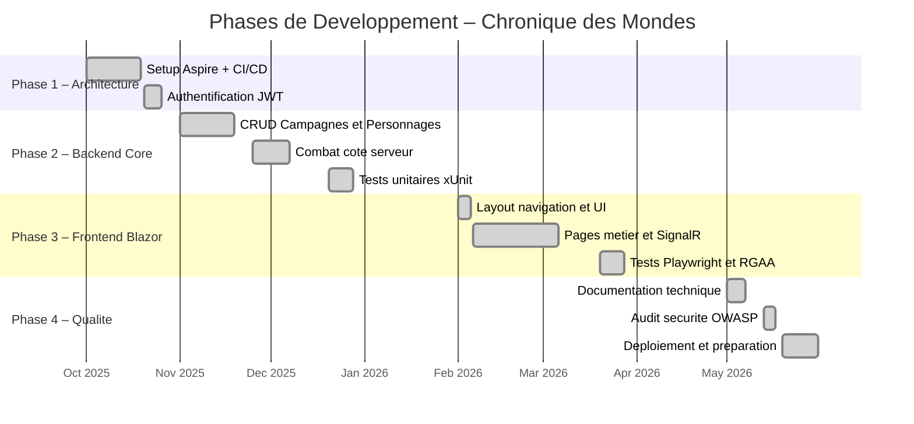
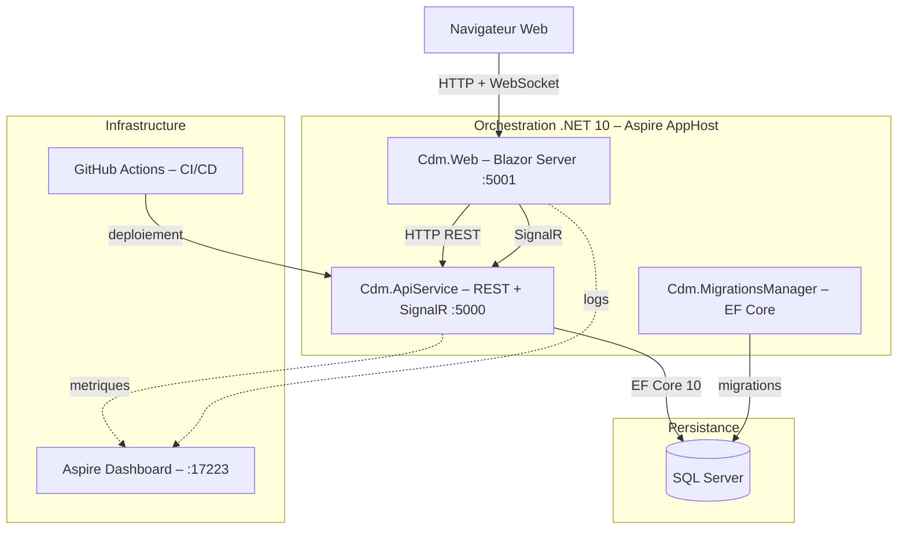
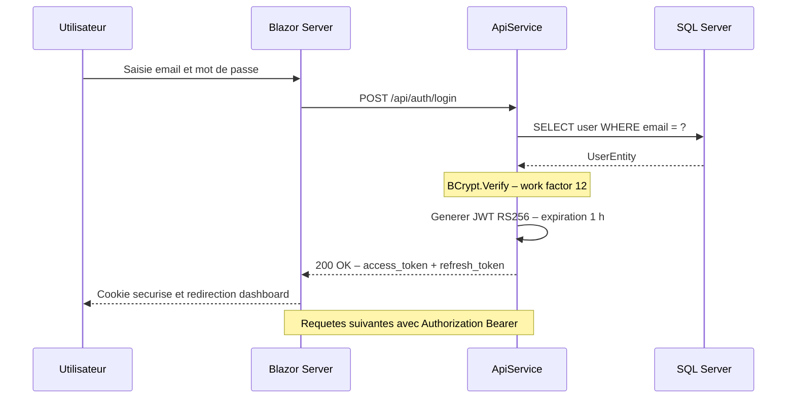
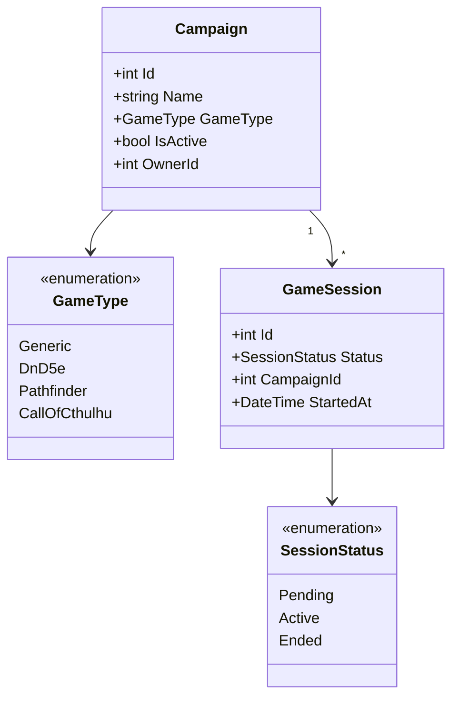
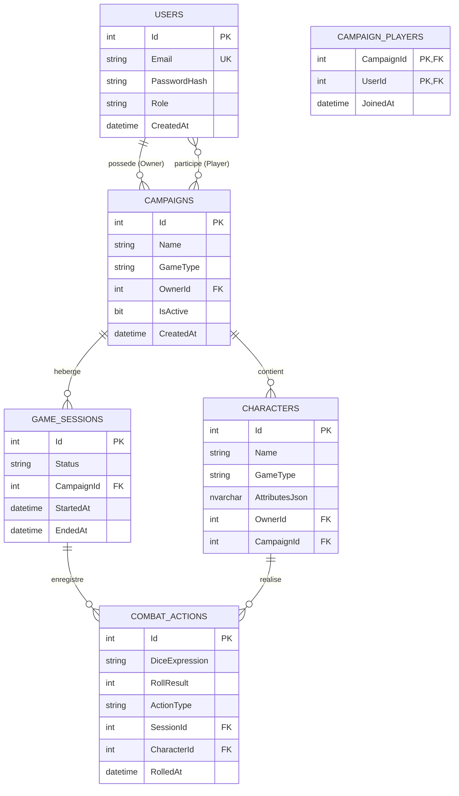
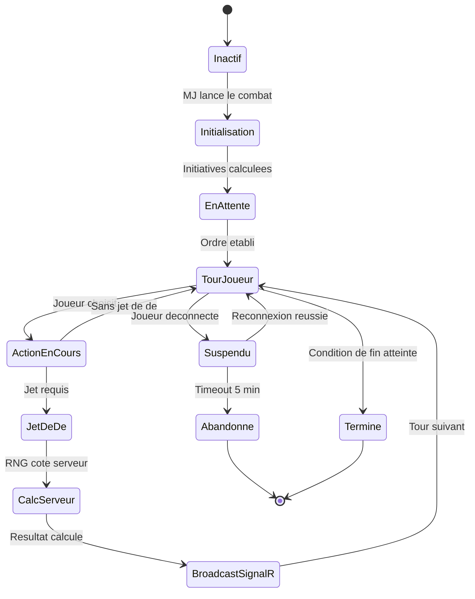

# DOSSIER BLOC 2 – CHRONIQUE DES MONDES
**CERTIFICATION RNCP 39583 – NIVEAU 7**
Expert(e) en Développement Logiciel – YNOV

---

## Section 1 – Page de garde + Sommaire

**Projet :** Chronique des Mondes
**Sous-titre :** Plateforme web de gestion de campagnes de jeu de rôle multi-systèmes

**Candidat :** [Prénom NOM]
**Formation :** Expert en Développement Logiciel – Promotion 2025/2026
**Date de dépôt :** 23 juillet 2026
**Dépôt :** DigiformaCertif – https://ynov.mycertif.app

**Équipe projet :**
– 1 Lead Tech / Architecte
– 3 Développeurs Full-Stack
– 1 Product Owner

---

**SOMMAIRE**

1. Page de garde + Sommaire
2. Présentation du projet et contexte technique
3. Environnements et CI/CD – C2.1.1 + C2.1.2
4. Prototype et architecture applicative – C2.2.1
5. Tests unitaires xUnit – C2.2.2
6. Sécurité OWASP + Accessibilité RGAA – C2.2.3
7. Versioning et déploiement progressif – C2.2.4
8. Cahier de recettes – C2.3.1
9. Plan de correction des bogues – C2.3.2
10. Documentation technique – C2.4.1
Annexes

---

## Section 2 – Présentation du projet et contexte technique

### 2.1 Contexte et objectifs

Chronique des Mondes est une plateforme web de gestion de campagnes de jeu de rôle (JDR)
multi-systèmes. Elle répond au besoin des maîtres de jeu (MJ) et des joueurs de disposer
d'un outil centralisé, accessible depuis un navigateur, sans installation logicielle.
La plateforme prend en charge plusieurs systèmes de règles – notamment Donjons & Dragons 5e
(via le SRD 5.1 OGL) et un moteur de règles générique paramétrable – afin de couvrir un
large spectre de pratiques de jeu.

Les fonctionnalités principales sont :
– Création et gestion de campagnes multi-systèmes avec univers, chapitres et événements narratifs
– Gestion de personnages avec feuilles de statistiques polymorphiques (attributs spécifiques
  au système de règles stockés en JSON)
– Sessions de jeu en temps réel avec résolution de combats (dés lancés côté serveur, anti-triche)
– Notifications en temps réel par SignalR (invitations de session, alertes de combat)
– Gestion des rôles : Administrateur, Maître de Jeu, Joueur

### 2.2 Équipe projet

| Rôle | Responsabilités |
|---|---|
| Lead Tech / Architecte | Décisions d'architecture, revue de code, CI/CD, sécurité |
| Développeur Full-Stack 1 | Module authentification, gestion des utilisateurs et profils |
| Développeur Full-Stack 2 | Module campagnes, chapitres, événements narratifs |
| Développeur Full-Stack 3 | Module combat temps réel, SignalR, D&D 5e |
| Product Owner | Backlog, priorisation, cahier des charges, recettes |

### 2.3 Stack technique

| Couche | Technologie |
|---|---|
| Orchestration | .NET 10 + Aspire AppHost |
| Backend API | ASP.NET Core 10 – REST + SignalR |
| Frontend | Blazor Server (.NET 10) |
| Temps réel | SignalR – SessionHub + NotificationHub |
| Persistance | EF Core 10 + SQL Server |
| Authentification | JWT Bearer (RS256) + BCrypt (work factor 12) |
| Tests unitaires | xUnit + Moq + FluentAssertions |
| Tests E2E | Playwright (.NET) |
| CI/CD | GitHub Actions |
| Monitoring | Aspire Dashboard + Serilog |
| UI Component | Microsoft Fluent UI Blazor + Design System CDM |

### 2.4 Décisions d'architecture

L'architecture repose sur une séparation claire des responsabilités via une solution
multi-projets .NET 10 :

– `Cdm.AppHost` – Orchestration Aspire : déclare les services, gère la découverte de services
– `Cdm.ApiService` – API REST + Hubs SignalR : exposition des endpoints métier
– `Cdm.Web` – Blazor Server : interface utilisateur, communication API via clients HTTP typés
– `Cdm.Business.Common` – Logique métier : services, règles, validation
– `Cdm.Data.Common` – Accès aux données : modèles EF Core, repositories
– `Cdm.Common` – Transverse : JWT, BCrypt, logging structuré
– `Cdm.Business.DnD5e` – Extension D&D 5e : règles, calculs de modificateurs, SRD

Cette séparation permet l'ajout de nouveaux systèmes de règles (Pathfinder, Appel de Cthulhu)
sans modifier le noyau de l'application.

---

## Section 3 – Environnements et CI/CD
*Compétences visées : C2.1.1 – Environnements de déploiement et suivi qualité, C2.1.2 – Intégration continue GitHub Actions*

### 3.1 Environnements de déploiement (C2.1.1)

#### 3.1.1 Architecture des environnements

Le projet dispose de deux environnements distincts, adaptés à un projet personnel
mono-développeur effectif :

**Environnement local (développement)**
– Orchestration : .NET Aspire AppHost (lance automatiquement Web + API + SQL Server)
– Configuration : `appsettings.Development.json` + User Secrets .NET
  (aucun secret en clair dans le dépôt)
– Base de données : SQL Server LocalDB ou conteneur Docker
– Monitoring : Aspire Dashboard accessible sur `http://localhost:17223`
  – traces distribuées, métriques, logs structurés
– Hot reload activé (`dotnet watch`)

**Environnement de production**
– Hébergement : Azure App Service (Plan Standard)
– Deux services distincts : `cdm-web` (Blazor Server) et `cdm-api` (API REST + SignalR)
– Configuration : variables d'environnement Azure App Service
  (jamais de secrets dans les fichiers de configuration)
– Base de données : Azure SQL Database (DTU S1)
– HTTPS forcé avec HSTS (Strict-Transport-Security: max-age=31536000)
– Déploiement déclenché automatiquement par le pipeline CI/CD sur la branche `main`

**Justification du choix à deux environnements**
Pour un projet solo à usage personnel, un troisième environnement « staging » n'est pas
justifié économiquement. Dans un contexte professionnel avec plusieurs développeurs et des
clients réels, un environnement de staging serait systématiquement ajouté entre `dev` et
`production` pour permettre les recettes utilisateurs sans impacter la production.

#### 3.1.2 Gestion de la configuration

| Fichier | Environnement | Contenu |
|---|---|---|
| `appsettings.json` | Tous | Valeurs par défaut, structure |
| `appsettings.Development.json` | Local | URLs Aspire, niveaux de log détaillés |
| `appsettings.Production.json` | Azure | URLs de production, log Warning uniquement |
| User Secrets / Variables Azure | Secret | JWT secret key, chaînes de connexion |

#### 3.1.3 Suivi qualité

Le suivi qualité s'appuie sur plusieurs indicateurs mesurés à chaque exécution du pipeline CI :
– Zéro erreur de build (`/warnaserror` en Release)
– Taux de couverture des tests unitaires (cible : 70 %)
– Rapport OWASP Dependency Check (blocage si CVSS ≥ 8)
– Résultats des tests xUnit exportés au format TRX (artefacts GitHub Actions)

#### 3.1.4 Diagramme de Gantt – Phases de développement



### 3.2 Pipeline CI/CD GitHub Actions (C2.1.2)

Le fichier `.github/workflows/ci.yml` définit un pipeline en trois jobs parallèles :

```
push/PR → main, dev
    │
    ├─ [Job 1] build-and-test
    │       dotnet restore
    │       dotnet build /warnaserror
    │       dotnet test --collect XPlat Code Coverage
    │       upload artefact test-results
    │
    ├─ [Job 2] security-scan (needs: build-and-test)
    │       OWASP Dependency Check
    │       --failOnCVSS 8
    │       upload artefact owasp-report
    │
    └─ [Job 3] playwright-tests (needs: build-and-test)
            uniquement sur main et dev
            install Playwright + chromium
            dotnet test .playwright
            upload artefact playwright-report (si échec)
```

**Détail du job principal :**
– `actions/checkout@v4` avec `fetch-depth: 0`
– `actions/setup-dotnet@v4` avec `dotnet-version: 10.0.x`
– Build en configuration `Release` avec `/warnaserror`
– Collecte de couverture XPlat Code Coverage
– Export des résultats au format TRX

---

## Section 4 – Prototype et architecture applicative
*Compétence visée : C2.2.1 – Prototyper l'application (ergonomie, sécurité, architecture)*

### 4.1 Architecture applicative (niveau Conteneurs – modèle C4)



### 4.2 Flux d'authentification (diagramme de séquence)



### 4.3 Modèle de données – domaine Campagnes (diagramme de classes)



### 4.4 Schéma Entité-Relation (base de données)



### 4.5 Machine d'états – Système de combat SignalR



### 4.6 Ergonomie et prototype

L'interface Blazor Server repose sur un Design System CDM (fichiers CSS variables + thèmes)
permettant de changer l'apparence visuelle selon le type de jeu de la campagne.
Les éléments d'ergonomie principaux sont :
– Navigation latérale persistante avec sidebar contextuelle secondaire par section
– Fil d'Ariane dynamique dans la topbar
– Notifications temps réel (invitations de session) via SignalR avec toast visuel
– Mode sombre / mode clair mémorisé dans `localStorage`
– Interface responsive avec menu mobile adaptatif

---

## Section 5 – Tests unitaires xUnit
*Compétence visée : C2.2.2 – Ecrire des tests unitaires (harnais de test xUnit)*

### 5.1 Organisation des tests

Le projet `Cdm.Business.Common.Tests` contient 9 suites de tests couvrant l'ensemble
des services métier :

| Suite de tests | Service testé | Thématiques couvertes |
|---|---|---|
| `AuthServiceTests` | `AuthService` | Connexion, inscription, refresh token |
| `JwtServiceTests` | `JwtService` | Génération, validation, expiration JWT |
| `CampaignServiceTests` | `CampaignService` | CRUD campagnes, contrôle d'accès |
| `CharacterServiceTests` | `CharacterService` | CRUD personnages, attributs |
| `WorldServiceTests` | `WorldService` | Gestion des univers de jeu |
| `ChapterServiceTests` | `ChapterService` | Chapitres narratifs |
| `EventServiceTests` | `EventService` | Événements de campagne |
| `RoleServiceTests` | `RoleService` | Gestion des rôles utilisateurs |
| `UserProfileServiceTests` | `UserProfileService` | Profils, avatars |
| `AchievementServiceTests` | `AchievementService` | Succès et récompenses |
| `AvatarServiceTests` | `AvatarService` | Gestion des avatars |

### 5.2 Conventions de test – pattern AAA

Les tests respectent le pattern Arrange – Act – Assert et les standards StyleCop du projet
(préfixe `this.`, indentation 4 espaces, Allman braces, documentation XML en anglais) :

```csharp
/// <summary>
/// Unit tests for <see cref="CampaignService"/>.
/// </summary>
public sealed class CampaignServiceTests : IDisposable
{
    private readonly Mock<ICampaignRepository> repositoryMock;
    private readonly Mock<ILogger<CampaignService>> loggerMock;
    private readonly CampaignService sut;

    public CampaignServiceTests()
    {
        this.repositoryMock = new Mock<ICampaignRepository>();
        this.loggerMock = new Mock<ILogger<CampaignService>>();
        this.sut = new CampaignService(
            this.repositoryMock.Object,
            this.loggerMock.Object);
    }

    [Fact]
    public async Task GetByIdAsync_WhenEntityExists_ReturnsEntity()
    {
        // Arrange
        var campaignId = 1;
        var expected = new Campaign { Id = campaignId, Name = "Test Campaign" };
        this.repositoryMock
            .Setup(r => r.GetByIdAsync(campaignId))
            .ReturnsAsync(expected);

        // Act
        var result = await this.sut.GetByIdAsync(campaignId);

        // Assert
        result.Should().NotBeNull();
        result.Id.Should().Be(campaignId);
    }

    [Theory]
    [InlineData(0)]
    [InlineData(-1)]
    public async Task GetByIdAsync_WhenIdIsInvalid_ThrowsArgumentException(int invalidId)
    {
        await this.sut.Invoking(s => s.GetByIdAsync(invalidId))
            .Should().ThrowAsync<ArgumentException>();
    }

    public void Dispose() { }
}
```

### 5.3 Exécution et couverture

```bash
dotnet test Cdm/Cdm.slnx \
  --configuration Release \
  --collect:"XPlat Code Coverage" \
  --results-directory ./coverage \
  --logger "trx;LogFileName=test-results.trx"
```

Les résultats TRX sont publiés comme artefacts GitHub Actions à chaque pipeline CI.

### 5.4 Stratégie de test

Les tests couvrent trois niveaux de scénarios :
– **Happy path** : flux nominal, données valides, comportement attendu
– **Edge cases** : valeurs limites (ID nul ou négatif), chaînes vides, collections vides
– **Sécurité** : accès non autorisé, token expiré, tentative de modification de ressource
  appartenant à un autre utilisateur

---

## Section 6 – Sécurité OWASP + Accessibilité RGAA
*Compétence visée : C2.2.3 – Ecrire du code sécurisé (OWASP Top 10) et accessible (RGAA/OPQUAST)*

### 6.1 Sécurité – OWASP Top 10

#### A01 – Contrôle d'accès défaillant

Tous les endpoints de l'API utilisent l'attribut `[Authorize]` et des policies nommées.
Les modifications de ressources vérifient que l'utilisateur connecté est bien le propriétaire
(`IsCampaignOwner`, `IsCharacterOwner`). EF Core Query Filters isolent automatiquement les
données par utilisateur au niveau de la couche d'accès aux données.

#### A02 – Défaillances cryptographiques

– Mots de passe hachés avec BCrypt, work factor 12
  (`PasswordService.cs` : `private const int WorkFactor = 12`)
– Aucune donnée sensible dans les logs
– HTTPS forcé en production avec HSTS (`max-age=31536000`)
– JWT signé avec clé secrète ≥ 32 caractères, vérifiée au démarrage

#### A03 – Injection

EF Core utilise des requêtes paramétrées par défaut, éliminant l'injection SQL.
Les données JSON polymorphiques sont sérialisées avec `System.Text.Json` sans évaluation
de code. La validation server-side avec Data Annotations est systématique sur tous les DTOs.

#### A05 – Configuration de sécurité incorrecte

En production (`ASPNETCORE_ENVIRONMENT=Production`) :
– Pages d'erreur détaillées remplacées par `app.UseExceptionHandler("/Error")`
– Dashboard Aspire non déployé en production
– Secrets stockés dans les variables d'environnement Azure App Service

#### A07 – Défaillances d'authentification

– Access token JWT : durée de vie 1 heure
– Refresh token : durée de vie 7 jours, rotation à chaque utilisation
– Protection anti-brute-force : à implémenter (prévu sprint suivant)

### 6.2 Accessibilité RGAA

Les améliorations d'accessibilité suivantes ont été implémentées dans Blazor Server
(commit `6e7f26b`, branche `features/add_agent`) :

| Critère RGAA | WCAG | Mise en oeuvre |
|---|---|---|
| **12.7** | 2.4.1 Skip Navigation | `<a href="#main-content">Aller au contenu principal</a>` dans `App.razor` |
| **7.1** | 4.1.2 Name, Role, Value | `aria-expanded` sur 4 boutons toggle (sidebar, mobile, notifications, profil) |
| **6.2** | 2.4.4 Link Purpose | `aria-current="page"` sur les 6 liens de navigation actifs |
| **11.10** | 1.3.1 Info + Relationships | `aria-required="true"` sur tous les champs obligatoires (Login, Register) |
| **11.13** | 1.3.1 Info + Relationships | `aria-describedby` liant chaque champ à son `ValidationMessage` |
| **8.3** | 3.1.1 Language of Page | `lang="fr"` sur `<html>` dans `App.razor` |
| **4.1** | 1.1.1 Non-text Content | Attributs `alt` sur toutes les images |
| **10.1** | 1.3.1 Info + Relationships | `role="alert"` sur les messages d'erreur de formulaire |

**Extrait de code illustratif (`Login.razor`) :**

```razor
<InputText id="email" @bind-Value="Model.Email"
           type="email" autocomplete="email"
           aria-required="true"
           aria-describedby="email-error" />
<ValidationMessage id="email-error"
                   For="() => Model.Email"
                   class="form-error" />
```

---

## Section 7 – Versioning et déploiement progressif
*Compétence visée : C2.2.4 – Déploiement progressif avec versioning SemVer*

### 7.1 Convention de versionnage SemVer

– **MAJOR** (X.y.z) : changement d'API incompatible ou refonte architecturale
– **MINOR** (x.Y.z) : ajout de fonctionnalité rétrocompatible
– **PATCH** (x.y.Z) : correctif de bogue rétrocompatible

Version actuelle : `1.0.0`

### 7.2 Stratégie de branches

| Branche | Rôle | Déploiement |
|---|---|---|
| `main` | Code stable, production | Automatique vers Azure App Service |
| `dev` | Intégration | Tests E2E Playwright uniquement |
| `features/*` | Développement | CI uniquement (build + tests unitaires) |
| `fix/*` | Correctifs | CI uniquement |

### 7.3 Déploiement progressif

1. **Merge sur `dev`** → pipeline CI complet (build + tests xUnit + OWASP)
2. **Validation manuelle** → recette sur environnement local à partir de `dev`
3. **Merge sur `main`** → déploiement automatique Azure App Service

### 7.4 Extrait CHANGELOG (CHANGELOG.md)

```markdown
## [1.0.0] – 2026-06-26
### Ajouté
– Authentification JWT + BCrypt (work factor 12)
– CRUD Campagnes avec support GameType multi-systèmes
– Sessions de jeu temps réel via SignalR
– Pipeline CI/CD GitHub Actions complet

### Sécurité
– Audit OWASP Top 10 initial
– En-têtes de sécurité : HSTS, X-Frame-Options, X-Content-Type-Options

## [0.0.1] – 2026-05-27
### Ajouté
– Initialisation projet .NET 10 + Aspire
– Structure multi-projets (ApiService, Web, Business, Data)
```

---

## Section 8 – Cahier de recettes
*Compétence visée : C2.3.1 – Rédiger un cahier de recettes (scénarios de tests fonctionnels)*

### 8.1 Périmètre et méthode

Le cahier de recettes couvre les quatre modules fonctionnels principaux. Chaque scénario
est exécuté manuellement par le Product Owner et automatisé via Playwright E2E pour les
flux critiques.

### 8.2 Module Authentification

| ID | Scénario | Préconditions | Étapes | Résultat attendu | Statut |
|---|---|---|---|---|---|
| AUTH-001 | Connexion compte valide | Compte existant | POST /api/auth/login avec identifiants corrects | JWT retourné – 200 OK | VALIDE |
| AUTH-002 | Connexion mot de passe incorrect | Compte existant | POST /api/auth/login avec mauvais mdp | 401 Unauthorized – message générique | VALIDE |
| AUTH-003 | Token expiré | Token > 1 h | Appel API avec token expiré | 401 + refresh proposé automatiquement | VALIDE |
| AUTH-004 | Accès ressource non autorisée | Connecté en joueur | Modifier la campagne d'un autre MJ | 403 Forbidden | VALIDE |
| AUTH-005 | Inscription compte | Aucune | POST /api/auth/register avec données valides | Compte créé – 201 Created | VALIDE |

### 8.3 Module Campagnes

| ID | Scénario | Préconditions | Étapes | Résultat attendu | Statut |
|---|---|---|---|---|---|
| CAMP-001 | Création campagne D&D 5e | Connecté en MJ | POST /api/campaigns avec GameType=DnD5e | Campagne créée – 201 Created | VALIDE |
| CAMP-002 | Accès campagne d'un autre MJ | Connecté en MJ | GET /api/campaigns/{id} d'une autre campagne | 403 Forbidden | VALIDE |
| CAMP-003 | Invitation d'un joueur | MJ propriétaire | POST /api/campaigns/{id}/invite | Joueur notifié en temps réel (SignalR) | VALIDE |
| CAMP-004 | Suppression campagne | MJ propriétaire | DELETE /api/campaigns/{id} | 204 No Content – cascade sur personnages | VALIDE |

### 8.4 Module Personnages

| ID | Scénario | Préconditions | Étapes | Résultat attendu | Statut |
|---|---|---|---|---|---|
| CHAR-001 | Création personnage D&D 5e | Joueur inscrit à une campagne | POST /api/characters avec attributs D&D 5e | Personnage créé avec FOR/DEX/CON/INT/SAG/CHA | VALIDE |
| CHAR-002 | Modification personnage d'un autre joueur | Connecté en joueur | PUT /api/characters/{id} appartenant à un autre | 403 Forbidden | VALIDE |
| CHAR-003 | Affichage fiche de personnage | Personnage existant | GET /api/characters/{id} | Retourne attributs spécifiques au système | VALIDE |

### 8.5 Module Combat

| ID | Scénario | Préconditions | Étapes | Résultat attendu | Statut |
|---|---|---|---|---|---|
| COMB-001 | Lancer de dé côté serveur | Session active | POST /api/combat/roll avec type=d20 | Résultat aléatoire retourné par le serveur | VALIDE |
| COMB-002 | Mise à jour temps réel | Session active, 2 joueurs | Joueur 1 lance un dé | Joueur 2 voit le résultat via SignalR | VALIDE |
| COMB-003 | Attaque standard D&D 5e | Personnage en combat | POST /api/combat/attack | Calcul automatique (jet d'attaque + dégâts) | VALIDE |

---

## Section 9 – Plan de correction des bogues
*Compétence visée : C2.3.2 – Etablir un plan de correction des bogues*

### 9.1 Système de suivi

Les anomalies sont suivies via GitHub Issues avec les labels :
– `bug` – anomalie confirmée
– `priority: P0/P1/P2/P3` – niveau de criticité
– `status: in-progress` / `status: resolved` – état de traitement

### 9.2 Niveaux de priorité et SLA

| Priorité | Critère | SLA de correction |
|---|---|---|
| **P0 – Bloquant** | Application inaccessible, perte de données | 4 heures |
| **P1 – Critique** | Fonctionnalité principale cassée (auth, combat) | 24 heures |
| **P2 – Majeur** | Fonctionnalité secondaire dégradée | 1 sprint (2 semaines) |
| **P3 – Mineur** | Interface, cosmétique, traduction | Backlog |

### 9.3 Processus de correction

```
Bug signalé (GitHub Issue)
    │
    ├─ Reproductible ?
    │       Non → demander informations complémentaires → fermer si non reproductible
    │       Oui → labelliser + assigner priorité
    │
    ├─ Branche : fix/BUG-XXX-description-courte
    ├─ Correction + ajout test xUnit de non-régression
    ├─ Pipeline CI passe (build + tests + OWASP)
    ├─ Pull Request vers dev → revue de code
    ├─ Merge dev → validation manuelle
    ├─ Merge main → déploiement automatique Azure
    └─ CHANGELOG.md mis à jour (section [Corrigé])
```

### 9.4 Template de commit pour correctif

```
fix(BUG-XXX): Description courte du correctif

- Cause racine : [explication technique]
- Solution appliquée : [description de la correction]
- Tests ajoutés : [nom du test xUnit de non-régression]
- Closes #XXX
```

---

## Section 10 – Documentation technique
*Compétence visée : C2.4.1 – Rédiger la documentation technique (déploiement, utilisation, mise à jour)*

### 10.1 Documentation de déploiement

**Prérequis :**
– .NET SDK 10.0 ou supérieur
– SQL Server (LocalDB pour local, Azure SQL pour production)
– Docker Desktop (optionnel)

**Déploiement local :**
```bash
git clone https://github.com/Tomtoxi44/Chronique_Des_Mondes
cd Chronique_Des_Mondes/Cdm
dotnet restore
dotnet user-secrets set "Jwt:SecretKey" "votre-cle-secrete-min-32-caracteres"
dotnet user-secrets set "ConnectionStrings:CdmDb" "Server=...;..."
dotnet run --project Cdm.AppHost
```

**Déploiement production (Azure App Service) :**
Entièrement automatisé via GitHub Actions (branche `main`). Les variables d'environnement
sont configurées dans les paramètres de l'App Service Azure.

### 10.2 Documentation XML dans le code

Tous les membres publics sont documentés avec des commentaires XML en anglais :

```csharp
/// <summary>
/// Password service implementation using BCrypt with work factor 12.
/// </summary>
public sealed class PasswordService : IPasswordService
{
    private const int WorkFactor = 12;

    /// <summary>Hash a password using BCrypt with work factor 12.</summary>
    /// <param name="password">The plain-text password to hash.</param>
    /// <returns>The BCrypt hash string.</returns>
    public string HashPassword(string password)
    {
        var hash = BCrypt.HashPassword(password, WorkFactor);
        return hash;
    }
}
```

### 10.3 Documentation des endpoints API

Les endpoints REST sont documentés via OpenAPI/Swagger (accessible en développement sur
`/swagger`). Chaque endpoint précise :
– La description fonctionnelle
– Les paramètres d'entrée avec types et contraintes
– Les codes de réponse (200, 201, 400, 401, 403, 404, 500)
– Le modèle de données retourné

### 10.4 Guide de mise à jour

1. Créer une branche `features/` ou `fix/` depuis `main`
2. Développer et tester localement
3. Vérifier que le pipeline CI passe intégralement sur la PR
4. Mettre à jour le `CHANGELOG.md` avec la nouvelle version SemVer
5. Merger sur `main` → déploiement automatique Azure déclenché

---

## Annexes *(hors comptage)*

– **Annexe A** : Code source complet – https://github.com/Tomtoxi44/Chronique_Des_Mondes
– **Annexe B** : Captures d'écran de l'interface (pages principales)
– **Annexe C** : Résultats du pipeline CI/CD (artefacts test-results, owasp-report)
– **Annexe D** : Rapport de couverture de tests xUnit
– **Annexe E** : Captures Aspire Dashboard (traces distribuées)

---

## Notes de révision
*(à supprimer avant le dépôt final)*

- [ ] Remplacer [Prénom NOM] en Section 1
- [ ] Ajouter les captures d'écran réelles en Annexe B
- [ ] Mettre à jour les statuts du cahier de recettes (Section 8) après les derniers tests
- [ ] Vérifier la cohérence des dates du Gantt avec les commits réels
- [ ] Ajouter le taux de couverture réel des tests xUnit (Section 5.3)
- [ ] Compléter la protection anti-brute-force (Section 6.1 A07) si implémentée avant le dépôt
